# Knowledge Graph Approaches

## Purpose

This note summarizes the investigation into how Neo4j knowledge graphs for web-development projects are typically built and which schema styles are most effective for describing a project that includes both business rules and codebase knowledge.

The focus is on approaches that help answer questions such as:

- what the project does at a business level
- which features belong to which domains
- which rules constrain those features
- where those rules are implemented in code
- which code, APIs, data stores, and documents are affected by a change

## Short conclusion

The most effective approach for a web-development project is usually not a pure code graph and not a pure documentation graph.

The strongest pattern is a hybrid graph with:

- a business/domain subgraph centered on `Domain`, `Feature`, `UseCase`, and `BusinessRule`
- a code subgraph centered on modules, files, classes, methods, APIs, and data artifacts
- a document or lexical subgraph that preserves provenance from docs, tickets, ADRs, and specs

The bridge between the business and technical views is usually the `Feature` node, sometimes supported by `UseCase`, `API`, and `Entity`.

## Typical build approaches

## Approach 1: business-first domain graph

This approach models the project primarily in terms of product meaning and system behavior. It is strongest when the main goal is understanding what the system does and why.

Typical inputs:

- domain documentation
- product specs
- Jira and Confluence content
- ADRs
- concept plans or curated summaries

Typical core nodes:

- `Domain`
- `Subdomain`
- `Feature`
- `UseCase`
- `BusinessRule`
- `Entity`
- `ValueObject`
- `Event`

Why teams use it:

- it matches how product and engineering usually talk about the system
- it makes rules and scope clearer than a code-only model
- it gives AI and engineers a stable conceptual layer above implementation details

Tradeoffs:

- weaker for precise impact analysis unless connected to code artifacts
- requires curation to avoid fuzzy or duplicated business concepts

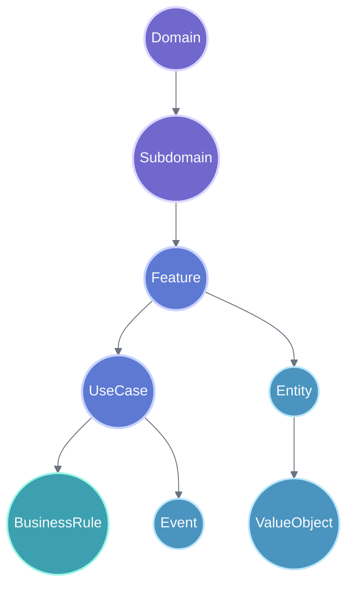

## Approach 2: code-first architecture graph

This approach starts from static structure and runtime-adjacent structure in the codebase. It is strongest when the main goal is dependency analysis, refactoring support, and implementation tracing.

Typical inputs:

- source code parsing
- build metadata
- dependency manifests
- API specs
- database schemas
- config files

Typical core nodes:

- `Repository`
- `Module`
- `Package`
- `Folder`
- `File`
- `Class`
- `Interface`
- `Method`
- `Endpoint`
- `DatabaseTable`
- `Queue`
- `ConfigFile`

Why teams use it:

- it is deterministic and easier to generate automatically
- it is excellent for dependency and impact queries
- it resembles common code-graph and code property graph patterns

Tradeoffs:

- it does not describe product intent well on its own
- it can become noisy if all low-level code detail is loaded without abstraction

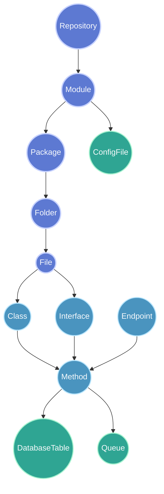

## Approach 3: document-grounded hybrid graph

This approach preserves source-document structure and extracts domain entities from it. It is strongest for AI retrieval, onboarding, and explaining why the system behaves in a certain way.

Typical inputs:

- wiki pages
- design docs
- tickets
- ADRs
- support notes
- code comments

Typical core nodes:

- `Document`
- `Chunk`
- `Domain`
- `Feature`
- `BusinessRule`
- `API`
- `Entity`
- `Decision`
- `Owner`

Why teams use it:

- it preserves provenance
- it supports question answering and traceable summaries
- it matches current Neo4j guidance around lexical and domain subgraphs

Tradeoffs:

- extracted entities need strong deduplication and normalization
- document-heavy graphs can become vague without a curated domain backbone

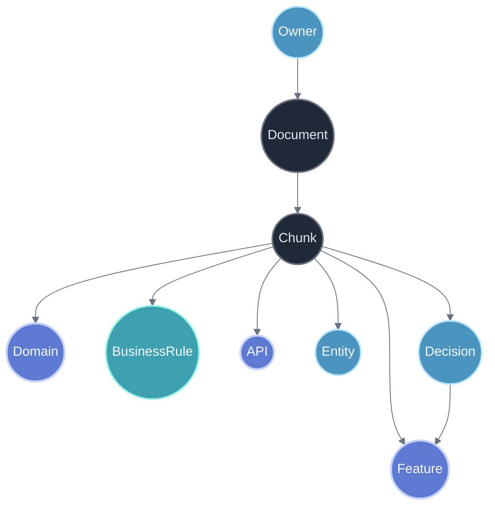

## Approach 4: rule-centric governance graph

This approach treats business rules, policies, constraints, and exceptions as first-class nodes. It is strongest when the project has complex validation, permissions, compliance, pricing, or workflow restrictions.

Typical inputs:

- backend validation code
- policy documentation
- specs
- tests
- customer-specific constraints

Typical core nodes:

- `Policy`
- `BusinessRule`
- `Constraint`
- `Exception`
- `Feature`
- `UseCase`
- `Field`
- `Validator`
- `TestCase`
- `Tenant`

Why teams use it:

- it makes hidden constraints explicit
- it helps find where a rule is enforced and how it is tested
- it is useful for migration and parity work

Tradeoffs:

- can feel abstract unless attached to features and code
- may over-fragment if every small validation becomes a separate node

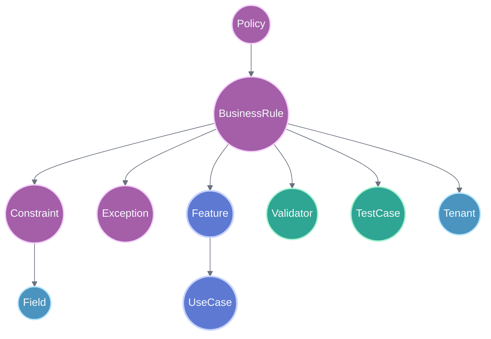

## Recommended schemas

Below are several practical schema styles that are good candidates for a project knowledge graph.

## Schema A: DDD and feature traceability

This is the best default schema when the goal is to describe the project in a way that is useful for both humans and AI systems.

Core nodes:

- `Domain`
- `Subdomain`
- `Feature`
- `UseCase`
- `BusinessRule`
- `Entity`
- `API`
- `UIPage`
- `Service`
- `Repository`
- `Table`
- `ExternalSystem`

Typical relationships:

- `HAS_SUBDOMAIN`
- `OWNS_FEATURE`
- `IMPLEMENTS_USE_CASE`
- `CONSTRAINED_BY`
- `USES_ENTITY`
- `EXPOSED_BY`
- `TRIGGERS`
- `REALIZED_BY`
- `READS`
- `WRITES`
- `CALLS_EXTERNAL`

Why it is good:

- very balanced between business meaning and implementation traceability
- `Feature` becomes a natural anchor for navigation
- supports common change-analysis and onboarding questions well

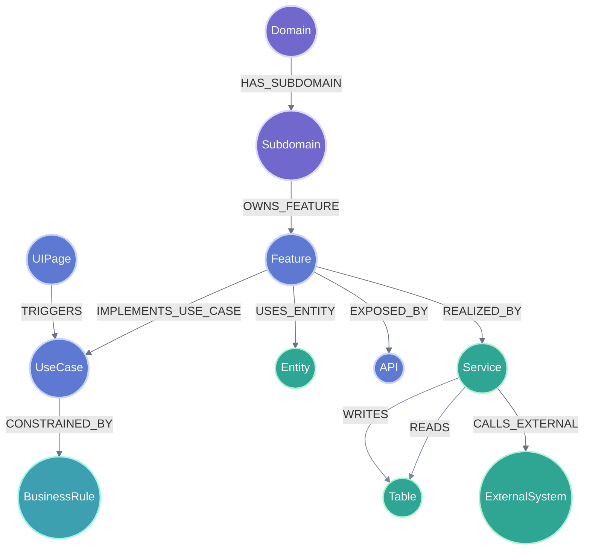

## Schema B: code and dependency graph

This is the best schema when the graph is mainly for engineering analysis, refactoring, dependency tracking, and architecture governance.

Core nodes:

- `Repository`
- `Module`
- `Package`
- `Folder`
- `File`
- `Class`
- `Interface`
- `Method`
- `Endpoint`
- `DatabaseTable`
- `Library`
- `ConfigFile`

Typical relationships:

- `CONTAINS`
- `DEPENDS_ON`
- `DECLARES`
- `IMPLEMENTS`
- `CALLS`
- `INSTANTIATES`
- `EXPOSES`
- `READS`
- `WRITES`
- `CONFIGURES`

Why it is good:

- highly automatable
- very strong for precise impact analysis
- aligns well with known code-graph patterns

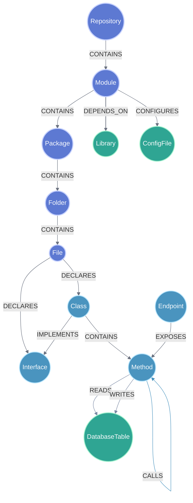

## Schema C: lexical and domain hybrid

This is the best schema when the graph must preserve document evidence and support AI retrieval, but still remain structured enough for engineering use.

Core nodes:

- `Document`
- `Chunk`
- `Domain`
- `Feature`
- `UseCase`
- `BusinessRule`
- `Entity`
- `API`
- `Class`
- `Method`
- `Decision`

Typical relationships:

- `HAS_CHUNK`
- `NEXT_CHUNK`
- `MENTIONS`
- `EXPLAINS`
- `AFFECTS`
- `IMPLEMENTED_BY`
- `ENFORCED_BY`
- `DOCUMENTED_IN`

Why it is good:

- strongest provenance and explainability
- strong fit for GraphRAG and project Q and A
- makes it easier to ground graph facts in source material

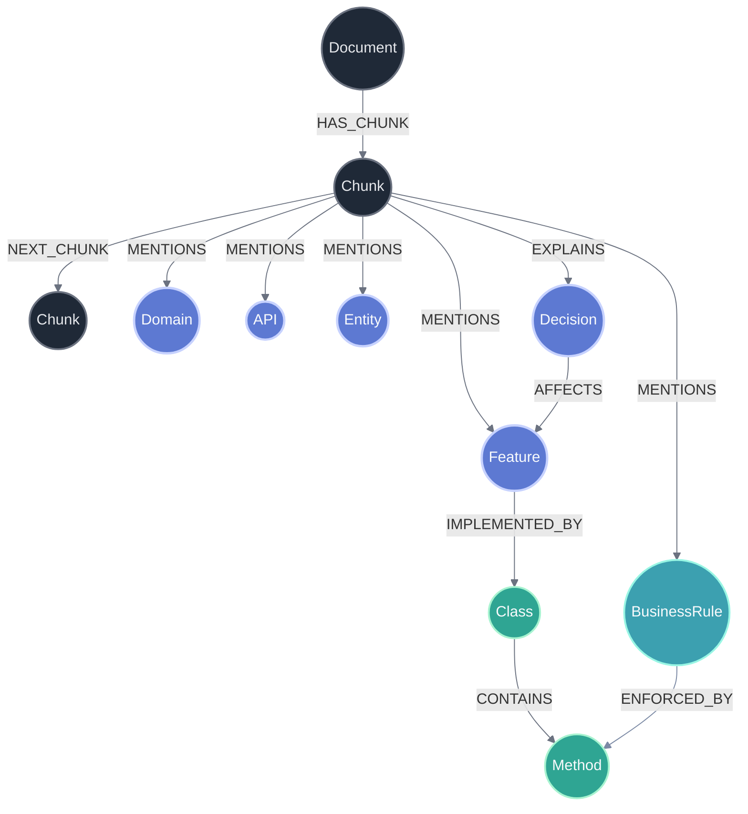

## Schema D: rule-centered project model

This is the best schema when business logic safety matters more than broad conceptual coverage.

Core nodes:

- `Policy`
- `BusinessRule`
- `Constraint`
- `Exception`
- `Feature`
- `UseCase`
- `Field`
- `API`
- `Validator`
- `TestCase`
- `Risk`

Typical relationships:

- `DEFINES`
- `APPLIES_TO`
- `HAS_EXCEPTION`
- `ENFORCED_BY`
- `VERIFIED_BY`
- `PROTECTS`
- `RISKS_BREAKING`

Why it is good:

- ideal for parity validation and regression prevention
- useful where rules are dispersed across many files and layers
- makes compliance and validation logic explicit

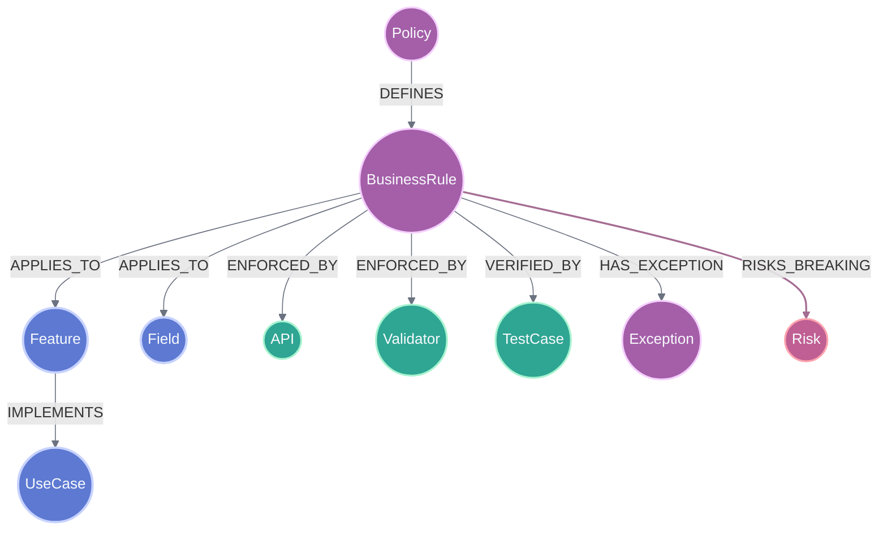

## Best overall recommendation

For a web-development project, the most effective overall schema is usually a hybrid of Schema A and Schema C, with selected parts of Schema B.

Recommended backbone:

- `Domain`
- `Feature`
- `UseCase`
- `BusinessRule`
- `Entity`

Recommended implementation layer:

- `UIPage`
- `API`
- `Service`
- `Class`
- `Method`
- `Table`
- `ExternalSystem`

Recommended provenance layer:

- `Document`
- `Chunk`
- `Decision`

Recommended bridging rules:

- `Feature` should be the central anchor between business and implementation
- `BusinessRule` should connect to both business context and code enforcement
- document nodes should support traceability, not replace curated domain modeling
- low-level code detail should be added selectively to avoid graph noise

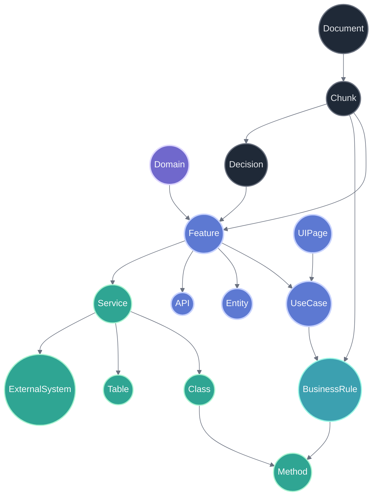

## Multi-source evidence graph for rule authority

If knowledge comes from Confluence, Jira, and implemented code at the same time, the best approach is not to merge them into one flat `BusinessRule` fact and not to choose one source too early.

The stronger pattern is:

- keep one canonical business layer with `Feature`, `UseCase`, `BusinessRule`, and `Context`
- attach source-specific evidence as separate nodes
- store source authority, freshness, and implementation state explicitly
- compute answer confidence from evidence instead of treating all statements as equally true

This aligns well with Neo4j's current lexical-plus-domain guidance and with W3C provenance modeling: keep the domain graph as the stable semantic layer, and connect it to document/code evidence rather than replacing it with raw source text.

### Why this is the best fit

For this specific problem, the sources do not have equal meaning:

- code usually expresses the strongest currently enforced business rules
- Jira usually expresses approved or planned decisions that may be partly implemented or not implemented yet
- Confluence usually expresses intent, background, or candidate ideas

Because of that, source strength should be modeled as evidence metadata and derived status, not as the identity of the rule itself.

The graph should answer two different questions separately:

- "What is the current enforced rule?"
- "What do our sources say, and how strong is each source?"

That separation avoids a common failure mode where planned Jira behavior or old Confluence ideas accidentally look as authoritative as running code.

### Recommended modeling pattern

Recommended stable nodes:

- `Feature`
- `UseCase`
- `BusinessRule`
- `Context`
- `CodeEvidence`
- `Document`
- `Chunk`
- `Decision`
- `RuleAssessment`

Recommended source metadata on `Document` or `CodeEvidence`:

- `sourceType`: `code`, `jira`, `confluence`
- `authorityRank`: for example `100`, `70`, `40`
- `freshnessAt`
- `status`: for example `implemented`, `planned`, `idea`, `superseded`
- `url` or `filePath`

Recommended relations:

- `Chunk -[:CLAIMS]-> BusinessRule`
- `CodeEvidence -[:ENFORCES]-> BusinessRule`
- `Decision -[:DECIDES]-> BusinessRule`
- `BusinessRule -[:HOLDS_IN]-> Context`
- `BusinessRule -[:ASSESSED_AS]-> RuleAssessment`
- `RuleAssessment -[:BASED_ON]-> Chunk`
- `RuleAssessment -[:BASED_ON]-> CodeEvidence`
- `Chunk -[:PART_OF]-> Document`

`RuleAssessment` is the important addition. It is where the graph records the interpreted state of the rule, such as:

- `effectiveStrength`: `enforced`, `decided`, `proposed`
- `confidence`: numeric score such as `0.95`
- `conflictLevel`: `none`, `low`, `high`
- `resolutionNote`
- `assessedAt`

This keeps the rule itself stable while allowing the graph to say that the same rule is strongly enforced in code, only planned in Jira, or merely suggested in Confluence.

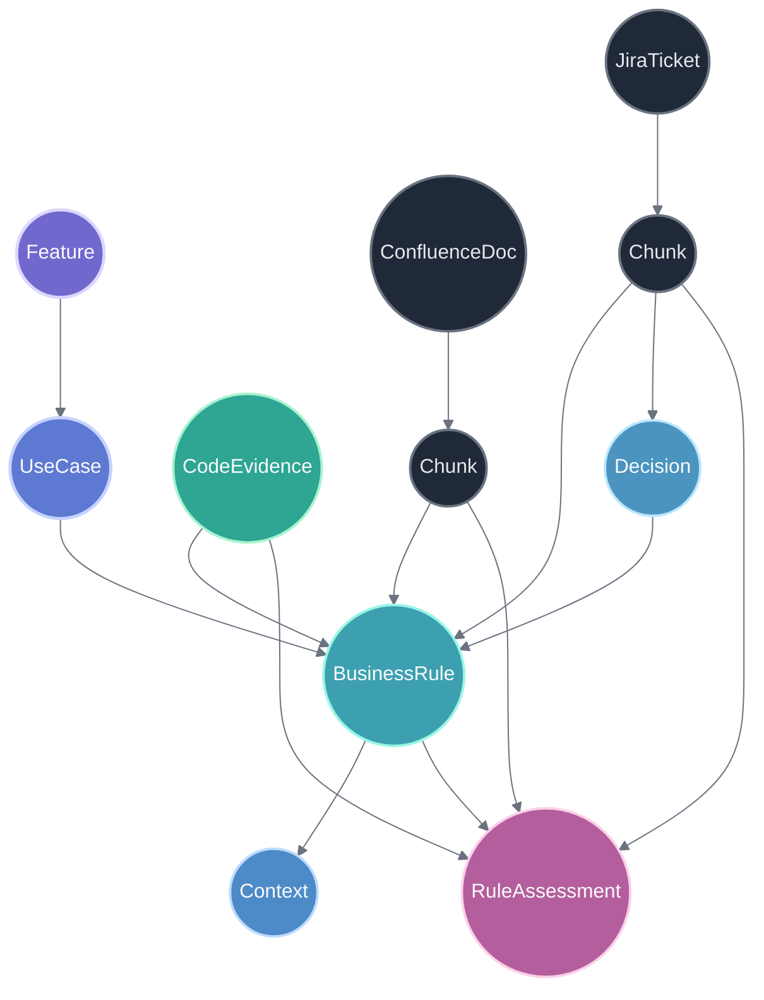

### How to represent source strength

The cleanest approach is a two-part model:

1. `authorityRank` by source class
2. `confidence` by actual evidence quality

Suggested default authority order:

- code: strongest for current behavior
- Jira: medium strength for approved or in-flight decisions
- Confluence: weaker for ideas, rationale, and background

Suggested interpretation:

- `authorityRank` answers how much the source type should matter
- `confidence` answers how certain we are that this specific statement is still valid

That means a Jira ticket can outrank old code only when the graph also knows the code is stale, dead, feature-flagged off, or intentionally being replaced. In other words, source precedence is a default, not an absolute law.

### Recommended query behavior

For safe answers, query in this order:

1. return `BusinessRule`
2. expand to `RuleAssessment`
3. expand to supporting `CodeEvidence`, `Decision`, `Document`, and `Chunk`
4. sort by `effectiveStrength`, `authorityRank`, `freshnessAt`, and `confidence`
5. surface conflicts explicitly instead of hiding them

This allows the graph to produce answers like:

- enforced in code, supported by two methods, confidence high
- planned in Jira, not yet implemented, confidence medium
- mentioned in Confluence only, confidence low

### Practical recommendation for this repository

For this repository, the best extension of the current graph is:

- keep the existing business-first backbone
- keep `CodeEvidence` as the strongest implementation anchor
- add a provenance subgraph with `Document`, `Chunk`, and `Decision`
- add `RuleAssessment` as the explicit place where cross-source interpretation lives
- mark answers `needs_review` when Jira, Confluence, and code disagree

This is better than a single weighted edge model because it stays explainable. Engineers can see not only that a rule is "strong", but why it is strong, which source made it strong, and whether there is an intentional planned change already recorded elsewhere.

## Practical guidance

When writing Mermaid in Markdown, it should be placed in fenced code blocks with the `mermaid` info string:

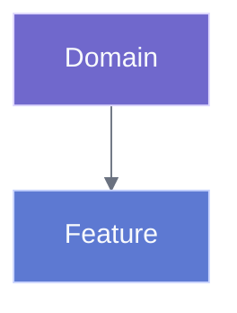

That is the right format for markdown-based documentation because:

- it keeps the source readable
- it renders in tools that support Mermaid
- it degrades gracefully as plain text where Mermaid rendering is unavailable

## Source notes

This investigation was based on:

- Neo4j documentation and blog material on knowledge graph generation, lexical and domain graph patterns, and schema guidance
- GraphRAG pattern guidance from Neo4j on combining lexical and domain subgraphs
- Neo4j material on codebase knowledge graphs and layered code graph modeling
- W3C provenance guidance for modeling source traceability and qualified evidence
- Joern and code property graph references for common code-graph structure

Useful references:

- https://graphrag.com/reference/knowledge-graph/domain-graph/
- https://graphrag.com/reference/knowledge-graph/lexical-graph/
- https://graphrag.com/reference/knowledge-graph/lexical-graph-extracted-entities/
- https://graphrag.com/reference/knowledge-graph/lexical-graph-hierarchical-structure/
- https://www.w3.org/TR/prov-o/
- https://neo4j.com/docs/neo4j-graphrag-python/current/user_guide_kg_builder.html
- https://neo4j.com/blog/developer/knowledge-graph-generation/
- https://neo4j.com/blog/developer/codebase-knowledge-graph/
- https://neo4j.com/blog/developer/describing-property-graph-data-model/
- https://neo4j.com/blog/developer/graph-type-schema-enforcement-made-easy-preview/
- https://docs.joern.io/code-property-graph/
- https://cpg.joern.io/
