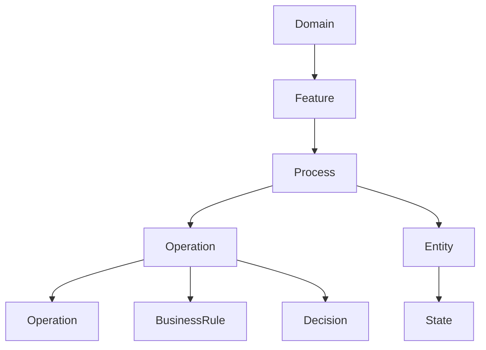
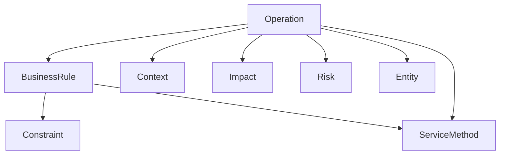
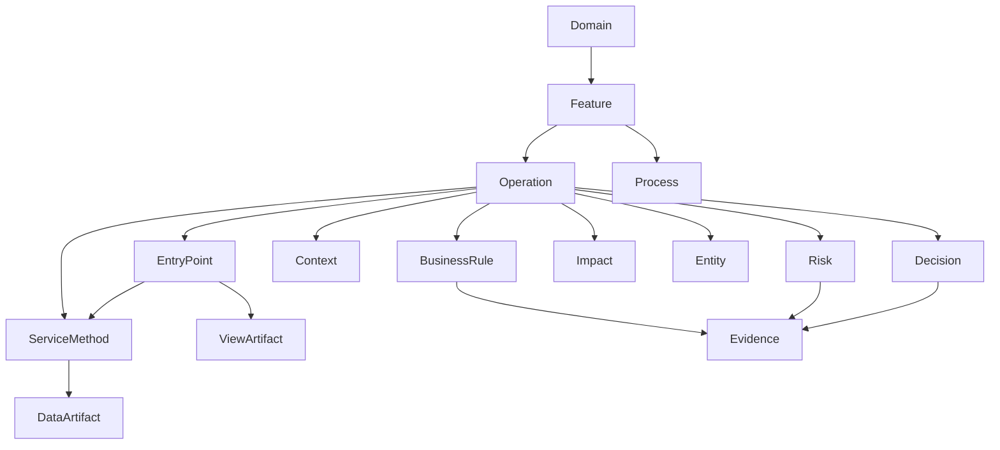
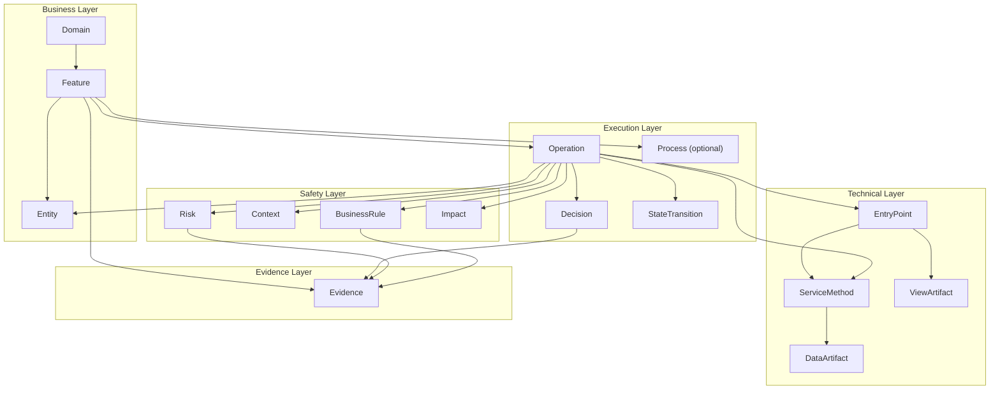
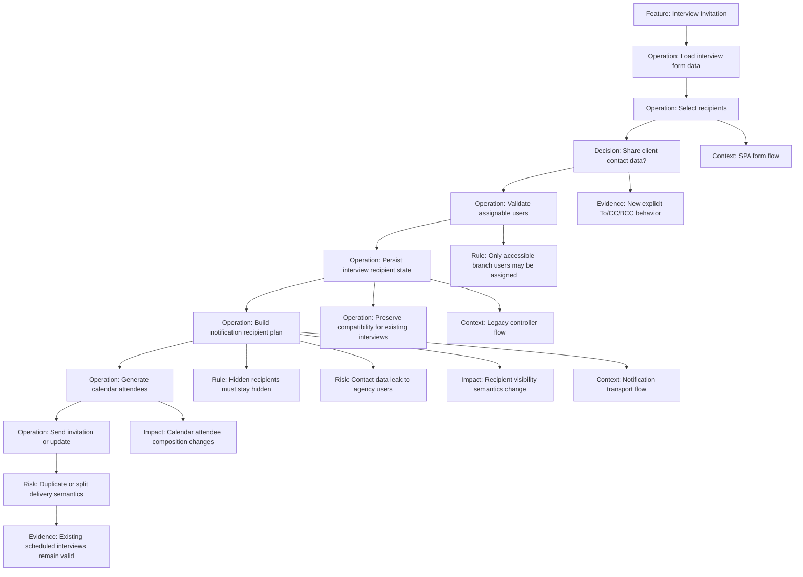

# Feature Development Graph Design for AVAX Portal

> **DEPRECATED — Superseded**
>
> This document was an early exploration for a specific codebase (AVAX Portal). The schema it proposes was never adopted.
>
> The final schema is documented in:
> - [`docs/architecture/neo4j-schema.md`](../neo4j-schema.md) — canonical schema reference
> - [`docs/architecture/schema-evolution-plan.md`](../schema-evolution-plan.md#final-decisions-settled) — final decisions and rationale
>
> Key differences from final schema: `Flow`, `Step`, `Process`, `Risk`, `Impact`, `Context`, `StateTransition`, `ViewArtifact`, `DataArtifact`, `Evidence` were **not adopted**. The final schema uses `Domain` → `Feature` → `Operation` + `Actor`, `BusinessRule`, `Entity`.

## Purpose

This note proposes a graph design for feature development in AVAX Portal.

The goal is not to build a generic code graph.
The goal is to help an AI agent and engineers understand:

- what business features and operations exist in the system
- which business decisions and rules shape those operations
- how the same entity is treated differently across modules and contexts
- which operations must happen sequentially
- which operations may happen in parallel
- which impacts, risks, and follow-up consequences are easy to miss
- where each rule or operation is implemented in code

This is especially important in this repository because apparently simple UI or field changes often cross:

- legacy Grails controller and GSP flows
- newer SPA and REST-adjacent flows
- service-layer business logic
- notification and transport logic
- background or follow-up processing
- compatibility behavior for already persisted data

## What The Project Structure Suggests

A quick codebase scan shows a large monolith with several overlapping concerns:

- domain-heavy Grails backend in `grails-app/domain`, `grails-app/services`, `grails-app/views`
- legacy controller and server-rendered view flows
- SPA/frontend code in `webpack/src`
- mixed old and new endpoint styles
- strong cross-cutting modules such as notifications, access, billing, background tasks, integrations, and approvals

Important implication:

The graph must not assume that a `Feature` maps neatly to one module, one controller, or one frontend page.
In this system, one feature often spans several technical contexts.

## Design Criteria

A useful graph for this project should:

1. start from features and operations, not from classes
2. model sequencing, optional branching, and parallelism explicitly
3. distinguish business rules from implementation details
4. distinguish execution contexts when the same operation behaves differently
5. connect business meaning to technical implementation and supporting evidence
6. show danger when one operation is skipped, reordered, or run independently
7. support feature-scoped impact analysis for tasks like VENDOR-9675

## Option 1: Feature And Process Map

This option centers on business features and processes.
It is the easiest model for human understanding and for AI onboarding.

Core nodes:

- `Domain`
- `Feature`
- `Process`
- `BusinessRule`
- `Decision`
- `Entity`
- `State`

Strengths:

- very readable
- strong for product and business understanding
- exposes sequence and branching well

Weaknesses:

- not strong enough alone for code impact analysis
- cross-layer implementation detail has to be attached later

## Option 2: Rule And Context Graph

This option centers on operations, rules, risks, and contexts.
It is stronger than option 1 for answering "what is allowed here?" and "why is this change dangerous?"

Core nodes:

- `Operation`
- `BusinessRule`
- `Risk`
- `Constraint`
- `Context`
- `Impact`
- `Entity`
- `ServiceMethod`

Strengths:

- strong for migration and safety analysis
- strong for finding hidden rules
- fits legacy-heavy systems well

Weaknesses:

- less intuitive as a project map
- weaker for explaining end-to-end business processes
- tends to flatten workflow into disconnected rule islands unless process structure is added

## Option 3: Legacy-Safe Hybrid Feature Graph

This is the recommended option.

It combines:

- a business map
- an operation and process layer
- a rule and decision layer
- an implementation and evidence layer

This is the best fit for AVAX Portal because the main problem is not only "where is this implemented?"
The main problem is:

- what operation is actually happening
- what business decision changes the path
- what must happen before or after
- what contexts interpret the same entity differently
- where each part lives in code

## Recommendation

Use a four-layer graph:

1. `Domain` and `Feature`
2. `Operation`, optional `Process`, `Decision`, `StateTransition`
3. `BusinessRule`, `Risk`, `Context`, `Impact`
4. technical implementation and evidence:
   `EntryPoint`, `ServiceMethod`, `ViewArtifact`, `DataArtifact`, `Evidence`

This keeps the graph business-first while making migration safety and hidden rule discovery explicit.

For migration work, implementation links should distinguish legacy and target behavior.
That distinction can live either:

- on the `Context` nodes
- or as properties on implementation relations such as `implementation: legacy|target|shared`

## Recommended Schema

### Business map layer

Stable top-level concepts:

- `Domain`
- `Feature`
- `SubFeature`
- optional `Process`
- `Entity`

Recommended meaning:

- `Domain`: stable product area such as Offers, Enquiries, Contracts, Employees, Billing, Approvals
- `Feature`: meaningful feature slice such as Interview Scheduling, Offer Acceptance, Invoice Assignment, Enquiry Distribution
- `Process`: optional end-to-end flow where a process view is genuinely useful
- `Entity`: stable domain object such as Offer, Interview, ClientUser, AgencyUser, Contract, InvoicePosition

### Operation layer

This should be the main execution layer for this repository.

Nodes:

- `Operation`
- optional `Process`
- `Decision`
- `StateTransition`

Recommended meaning:

- `Operation`: a meaningful action the system or user performs, such as Create Interview, Update Interview Recipients, Send Invitation, Cancel Invitation, Recalculate Invoice
- `Process`: only when several operations form a stable end-to-end flow worth naming
- `Decision`: a branch point where rules or configuration change behavior
- `StateTransition`: a lifecycle mutation caused by one or more operations

Why `Operation` is a better default here:

- it fits migration work naturally
- it is easier to connect to legacy and new code paths
- it helps compare old versus new implementations of the same behavior
- it avoids forcing every feature into a process decomposition where that adds little value

### Rule and safety layer

Nodes:

- `BusinessRule`
- `Constraint`
- `Risk`
- `Context`
- `Impact`

Recommended meaning:

- `BusinessRule`: allowed, required, or forbidden behavior
- `Constraint`: precise validation or access condition
- `Risk`: hidden coupling, data leak, duplicate send, broken sequence, scope mismatch
- `Context`: where behavior is interpreted, for example legacy controller flow, SPA form flow, background task flow, notification transport flow, migration scope, company-role perspective
- `Impact`: observable consequence beyond the direct write, such as sending mail, regenerating calendar attendees, recalculation, status mutation, audit logging, compatibility fallback

### Implementation and evidence layer

Nodes:

- `EntryPoint`
- `ServiceMethod`
- `ViewArtifact`
- `DataArtifact`
- `Evidence`

Recommended meaning:

- `EntryPoint`: technical entry into behavior such as route, endpoint, controller action, event handler, job trigger
- `ServiceMethod`: the main implementation node; a service-layer, orchestration, transport, or business-logic method that realizes an operation
- `ViewArtifact`: UI component, page, GSP, Gson template, modal, or form rendering unit
- `DataArtifact`: domain class, DTO, join table, payload shape
- `Evidence`: task note, plan, ADR, Confluence note, meeting note, legacy investigation note, approved decision note

This layer should not be treated as flat.
It has its own internal structure:

- `EntryPoint`: where behavior starts technically
- `ServiceMethod`: where the main implementation logic lives
- `ViewArtifact`: how behavior is rendered or initiated in UI/server views
- `DataArtifact`: what structures are read or written
- `Evidence`: why we believe the model is correct

Recommended `Evidence.kind` values:

- `jira`
- `adr`
- `meeting-note`
- `legacy-investigation`
- `decision-note`
- `task-plan`
- `local-doc`

Why `ServiceMethod` is explicit:

- in this repository, service methods are often where the real business behavior lives
- they are the most useful bridge between business operations and legacy implementation
- they are much more informative than a vague generic node like `CodeUnit`

For this repository, implementation provenance matters almost as much as the implementation node itself.
The graph should be able to answer:

- is this operation implemented only in legacy flow
- only in target flow
- in both
- partially migrated

## Recommended Relationships

### Top-level structure

- `Domain -[:HAS_FEATURE]-> Feature`
- `Feature -[:HAS_SUBFEATURE]-> SubFeature`
- `Feature -[:HAS_PROCESS]-> Process`
- `Feature -[:HAS_OPERATION]-> Operation`
- `Feature -[:USES_ENTITY]-> Entity`
- `Entity -[:USED_IN_FEATURE]-> Feature`
- `Entity -[:RELATES_TO]-> Entity`

Why these matter:

- `Feature -> Entity` shows which business things the feature works with
- `Entity -> Feature` supports reverse lookup from a thing to all affected features
- `Entity -> Entity` captures stable business relationships such as `Interview -> Recipient`, `Offer -> Interview`, `Invoice -> InvoicePosition`

### Optional process structure

If a feature really benefits from an explicit process map, use:

- `Process`
- `Operation`
- `Decision`
- `StateTransition`

- `Process -[:STARTS_WITH]-> Operation`
- `Process -[:INCLUDES]-> Operation`
- `Operation -[:NEXT]-> Operation`
- `Operation -[:BRANCHES_ON]-> Decision`
- `Decision -[:TRUE_PATH]-> Operation`
- `Decision -[:FALSE_PATH]-> Operation`
- `Operation -[:CAUSES_TRANSITION]-> StateTransition`

`Process` is optional.
If it adds little value, connect operations directly to each other and skip the process layer.

### Operation ordering and concurrency

These relations are critical for this project:

- `Operation -[:MUST_PRECEDE]-> Operation`
- `Operation -[:MAY_RUN_IN_PARALLEL_WITH]-> Operation`
- `Operation -[:MUST_NOT_RUN_IN_PARALLEL_WITH]-> Operation`
- `Operation -[:DEPENDS_ON]-> Operation`
- `Operation -[:APPLIES_TO]-> Entity`
- `Operation -[:CAUSES_TRANSITION]-> StateTransition`

These can also carry properties:

- `reason`
- `severity`
- `failureMode`

### Rules and safety

- `Feature -[:GOVERNED_BY]-> BusinessRule`
- `Operation -[:GUARDED_BY]-> BusinessRule`
- `BusinessRule -[:APPLIES_TO]-> Entity`
- `Constraint -[:APPLIES_TO]-> Entity`
- `BusinessRule -[:SPECIALIZED_AS]-> Constraint`
- `BusinessRule -[:APPLIES_IN]-> Context`
- `Operation -[:RUNS_IN]-> Context`
- `Operation -[:HAS_RISK]-> Risk`
- `Operation -[:CAUSES_IMPACT]-> Impact`
- `BusinessRule -[:MITIGATES]-> Risk`
- `Decision -[:EVIDENCED_BY]-> Evidence`
- `Risk -[:EVIDENCED_BY]-> Evidence`
- `BusinessRule -[:EVIDENCED_BY]-> Evidence`

These are the key relations that justify `Entity` as a business-layer node:

- `BusinessRule -> Entity` because rules often constrain a thing, not just an action
- `Constraint -> Entity` because validations frequently belong to a business object across multiple operations
- `Operation -> Entity` because operations need a stable target beyond a specific code path
- `Operation -> StateTransition` because many modernization risks come from state-sensitive behavior

### Business-to-code bridge

- `Operation -[:IMPLEMENTED_BY]-> EntryPoint`
- `Operation -[:IMPLEMENTED_BY]-> ServiceMethod`
- `Decision -[:IMPLEMENTED_BY]-> ServiceMethod`
- `BusinessRule -[:ENFORCED_BY]-> EntryPoint`
- `BusinessRule -[:ENFORCED_BY]-> ServiceMethod`
- `Impact -[:IMPLEMENTED_BY]-> ServiceMethod`
- `Context -[:ENTERED_VIA]-> EntryPoint`
- `EntryPoint -[:CALLS]-> ServiceMethod`
- `EntryPoint -[:RENDERS]-> ViewArtifact`
- `ViewArtifact -[:CALLS]-> EntryPoint`
- `ServiceMethod -[:READS]-> DataArtifact`
- `ServiceMethod -[:WRITES]-> DataArtifact`
- `Evidence -[:SUPPORTS]-> BusinessRule`
- `Evidence -[:SUPPORTS]-> Risk`
- `Evidence -[:SUPPORTS]-> Decision`
- `Evidence -[:SUPPORTS]-> Feature`
- `Evidence -[:REFERENCES]-> EntryPoint`
- `Evidence -[:REFERENCES]-> ServiceMethod`
- `Evidence -[:REFERENCES]-> ViewArtifact`
- `Evidence -[:REFERENCES]-> DataArtifact`

Recommended relation properties for migration scenarios:

- `implementation`: `legacy`, `target`, `shared`
- `parity`: `unknown`, `partial`, `matched`, `intentional-difference`
- `confidence`: numeric confidence in the mapping

Recommended `StateTransition` properties:

- `entity`
- `fromState`
- `toState`
- `transitionKind`

## Why This Schema Fits AVAX Portal

### 1. It models mixed contexts explicitly

This repository contains:

- server-rendered views
- legacy controllers
- SPA components
- REST-style endpoints
- notification logic
- background tasks

The same feature or operation may cross several of those contexts.
Without an explicit `Context` layer, an AI agent will often merge behaviors that are actually context-specific.

### 2. It preserves legacy behavior while allowing new decisions

The main modernization challenge here is:

- do not break legacy behavior customers already know
- detect hidden rules before reimplementing behavior
- record intentional new decisions when the new flow should differ

This is why the graph should store both:

- risks and rules that describe legacy-sensitive behavior
- decisions and evidence that describe approved target behavior

It should also support mixed states during migration, where one operation may have:

- a legacy implementation still used in production
- a target implementation under rollout
- intentional differences documented by decision evidence

### 3. It still supports sequencing where sequencing matters

Some flows are best understood as operations, not full process maps.
Still, there are cases where ordering matters.

That is why:

- `Operation` should be the default execution node
- `Process` should be optional
- ordering and parallelism relations should attach directly to operations

### 4. It keeps code as evidence, not as the main abstraction

If the graph starts from classes and methods alone, it will reproduce implementation noise.
For feature work, the more valuable structure is:

- process
- rules
- decisions
- contexts
- side effects

Then implementation nodes are attached underneath, and evidence nodes explain why the mapping is trusted.

### 5. It can represent different meanings of the same entity

In this project, the same entity can mean different things depending on:

- company role
- branch scope
- client versus agency side
- legacy versus new flow
- notification channel
- lifecycle state

The graph should therefore connect:

- `Entity`
- `Context`
- `BusinessRule`
- `Decision`

instead of assuming one global interpretation.

It should also connect:

- `Operation -> Entity`
- `BusinessRule -> Entity`
- `Constraint -> Entity`
- `Operation -> StateTransition`

so that entity-specific rules and state-sensitive behavior are directly queryable.

## Example: Interview Invitation Feature

The VENDOR-9675 task is a strong example of why this graph should be operation-aware and migration-safe.

At first glance, the change appears to be:

- replace recipient fields in the interview form

But the real operation set includes:

- define invitation recipients
- validate which users are selectable
- persist recipient-related state
- decide whether client contact data is shared
- build visible versus hidden recipient sets
- generate calendar attendees
- send notifications
- preserve behavior for already scheduled interviews
- cancel or update invitations correctly

## How The Example Maps To This Repository

A graph built with this schema would connect the interview feature and operations to code such as:

- UI form in [interviewForm.vue](/Users/akravchyna/projects/gp/AVAX-Portal/webpack/src/components/interview/interviewForm.vue)
- endpoint definitions in [http-endpoints.ts](/Users/akravchyna/projects/gp/AVAX-Portal/webpack/src/common/http-endpoints.ts)
- controller orchestration in [InterviewController.groovy](/Users/akravchyna/projects/gp/AVAX-Portal/grails-app/controllers/com/avax/offer/InterviewController.groovy)
- calendar and invitation orchestration in [InterviewService.groovy](/Users/akravchyna/projects/gp/AVAX-Portal/grails-app/services/com/avax/offer/InterviewService.groovy)
- notification recipient logic in [EmailService.groovy](/Users/akravchyna/projects/gp/AVAX-Portal/grails-app/services/com/avax/notification/EmailService.groovy)
- persisted interview state in [Interview.groovy](/Users/akravchyna/projects/gp/AVAX-Portal/grails-app/domain/com/avax/offer/Interview.groovy)
- rendering payload in [grails-app/views/interview/_interview.gson](/Users/akravchyna/projects/gp/AVAX-Portal/grails-app/views/interview/_interview.gson)

This is the important point:

One visible field change crosses UI, controller validation, domain persistence, recipient semantics, calendar composition, email transport behavior, and compatibility expectations.
That is exactly the sort of hidden coupling the graph should expose quickly.

## Minimal Query Shapes The Graph Should Support

The schema should make it easy to answer questions like:

- which operations belong to `Interview Invitation`
- which operations must run sequentially
- which operations must not run in parallel
- which business rules protect recipient visibility
- where is the rule enforced
- what impacts happen after recipient selection changes
- which legacy-preservation constraints apply to existing interviews
- which other features reuse the same recipient or notification semantics
- whether the relevant behavior is still legacy-only, target-only, or mixed

Example query intents:

1. "Show the full operation map behind interview invitation recipients."
2. "What risks appear if recipient selection is changed without changing notification transport?"
3. "Which operations depend on branch accessibility and user role?"
4. "Which features are affected by changing email visibility semantics?"
5. "Which code paths implement the decision to share or not share contact data?"
6. "Which rules apply to Interview across multiple features?"
7. "Which operations cause Interview transitions into `DELETED` or `SENT`?"
8. "Which entities are interpreted differently in legacy controller flow versus notification transport flow?"
9. "Which operations are still legacy-only and which already have target implementations?"

## Recommended Modeling Conventions

### Keep feature and operation nodes stable

Do not create a new `Feature` or `Operation` for every ticket.
They should be durable system concepts such as:

- Interview Invitation
- Send Interview Invitation
- Cancel Interview Invitation
- Accept Offer
- Create Contract
- Edit Invoice Assignment

Tickets should link to durable graph concepts, not replace them.

### Model tickets and plans as evidence

Use:

- `Evidence`

for Jira, task notes, plans, meeting clarifications, and investigations.

Those nodes should:

- support claims
- capture rationale
- explain why the process is being changed

They should not become the main business graph.

### Store new decisions explicitly

When modernization introduces intentional behavior changes, store them directly.

Use:

- `Decision`
- `Evidence`
- `Risk`

to distinguish:

- preserved legacy logic
- newly approved target behavior
- temporary coexistence rules during migration

### Keep code units semantically typed

Avoid one generic "code evidence" bucket if possible.
At minimum, distinguish:

- `EntryPoint`
- `ServiceMethod`
- `ViewArtifact`
- `DataArtifact`

This will make traversals much clearer.

### Prefer operation-level impacts over low-level call chains

Do not start by importing every method call.
First model:

- send invitation
- generate calendar
- update status
- trigger recalculation
- log action
- propagate integration payload

Only then attach the relevant code units.

## Practical Recommendation

If there is only time to build one strong graph for feature development, build this:

- operation-first
- context-aware
- rule-aware
- migration-safe
- evidence-backed

In short:

- top anchor: `Domain -> Feature`
- execution anchor: `Feature -> Operation -> Decision / Impact`
- safety anchor: `BusinessRule`, `Risk`, `Context`
- traceability anchor: typed implementation nodes plus supporting evidence

## Final Recommendation

For AVAX Portal, the best graph is not a billing-only graph, not a code graph, and not a ticket graph.

The best graph is a **legacy-safe hybrid feature graph** where:

- the main unit is a feature with durable operations
- decisions are first-class
- rules and risks are explicit
- contexts explain why the same concept behaves differently
- legacy-sensitive behavior is preserved through rules, risks, and evidence
- new decisions are stored explicitly as target behavior through decisions and evidence
- technical artifacts are attached as implementation trace
- tickets, plans, and discussions are attached as rationale

That design gives an AI agent the missing layer that the code alone does not provide:

- business meaning
- operation order
- decision points
- hidden constraints
- cross-module coupling
- safe paths for change
