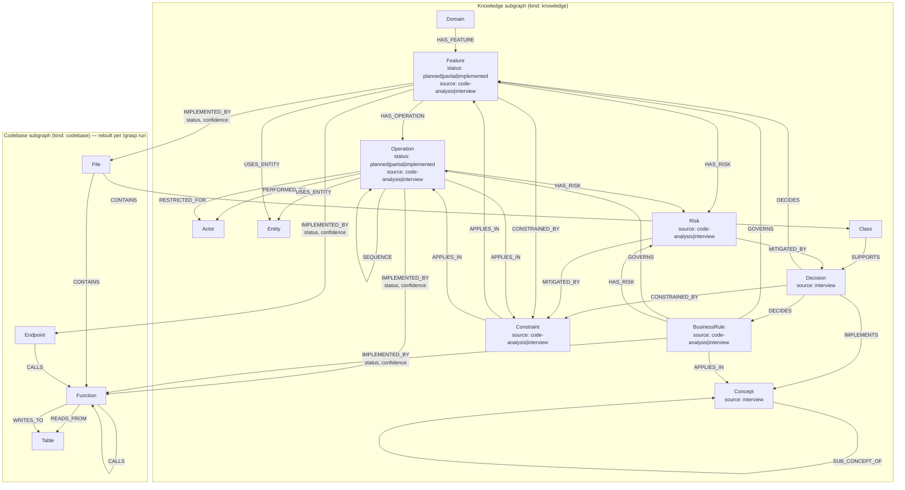

# Neo4j Schema Design

## Purpose

Grasp-It builds two complementary knowledge graphs stored in a **single Neo4j database**:

- **Codebase subgraph** — structural facts extracted from source code: files, functions, classes,
  modules, imports, calls. Generated deterministically by `/grasp` scripts, no LLM required for
  structure (LLM adds summaries only). Rebuilt on every `/grasp` run.

- **Knowledge subgraph** — product and domain knowledge: business domains, features, operations,
  actors, business rules, decisions, and constraints. Populated by:
  - `/grasp-domain` — mines domain and feature knowledge from the codebase
  - `/grasp-requirements` — interviews the Product Owner to distil planned feature knowledge

The knowledge subgraph stores knowledge of two kinds:
- **Implemented** — what the codebase currently does, extracted by analysis
- **Planned** — what the PO envisions for a new or changed feature, extracted from interviews

Knowledge nodes carry a `source` property that records where the knowledge came from:
- `"code-analysis"` — mined from the codebase by `/grasp-domain`
- `"interview"` — extracted from a specialist/PO conversation by `/grasp-requirements`
- `"wiki"` — ingested from documentation by `/grasp-knowledge` (future)

Both subgraphs are used together to create tasks, build implementation plans, design test cases,
and drive implementation. The `IMPLEMENTED_BY` relationship bridges them — tracing a planned
feature or operation directly to the code that realizes it.

---

## Single Database Strategy

**One Neo4j database. Two logical subgraphs. Separated by the `kind` node property.**

The `kind` property (`"codebase"` or `"knowledge"`) acts as the logical separator. All indexes
are `kind`-scoped. The primary use case — "which files implement this feature?" and its reverse
"which features touch this file?" — requires `IMPLEMENTED_BY` to be a native Neo4j relationship
traversable in both directions. That is only possible within a single database.

### Rebuild pattern

The codebase subgraph is rebuilt on every `/grasp` run:

```cypher
-- Wipe codebase nodes and all their relationships
MATCH (n) WHERE n.kind = "codebase" DETACH DELETE n
```

Knowledge nodes survive because the wipe is scoped by `kind`. The `IMPLEMENTED_BY`
relationships are rewritten after each rebuild by re-linking knowledge nodes to their new
codebase counterparts (matched by `id`).

---

## Labeling Convention

Node labels are Neo4j-friendly PascalCase strings (e.g. `File`, `BusinessRule`).
Relationship types are UPPER_SNAKE_CASE (e.g. `:CONTAINS`, `:IMPLEMENTED_BY`).

Each node's subgraph origin is tracked by the `kind` property (`"codebase"` or `"knowledge"`).
Knowledge nodes additionally carry a `source` property (`"code-analysis"` | `"interview"` | `"wiki"`)
that records which skill produced them — enabling queries that distinguish implemented facts from
specialist-described intent.

**Codebase nodes** use the `Codebase:` grouping label with a secondary type label: `Codebase:File`,
`Codebase:Function`, `Codebase:Class`, `Codebase:Module`, `Codebase:Config`,
`Codebase:Table`, `Codebase:Endpoint`, `Codebase:Document`, `Codebase:Service`,
`Codebase:Pipeline`, `Codebase:Schema`, `Codebase:Resource`.

**Knowledge nodes** use the `Knowledge:` grouping label with a secondary type label:
`Knowledge:Domain`, `Knowledge:Feature`, `Knowledge:Actor`, `Knowledge:BusinessRule`,
`Knowledge:Operation`, `Knowledge:Entity`, `Knowledge:Decision`, `Knowledge:Constraint`.

### Internal type representation

The JSON graph format and `schema.ts` enum use **lowercase** internal type strings (e.g. `"file"`,
`"domain"`, `"business-rule"`). When writing to Neo4j, the persistence layer converts these to
PascalCase labels and UPPER_SNAKE_CASE relationship types using the transformation functions in
`schema.ts`:

- **`toNeo4jLabel(type)`** — converts lowercase/kebab-case to PascalCase
  - `"file"` → `File`, `"business-rule"` → `BusinessRule`, `"endpoint"` → `Endpoint`
- **`toNeo4jRelationshipType(type)`** — converts lowercase to UPPER_SNAKE_CASE
  - `"imports"` → `IMPORTS`, `"implemented_by"` → `IMPLEMENTED_BY`, `"governs"` → `GOVERNS`

These functions are idempotent and provide a uniform transformation rule — no special-casing of
individual node or relationship types is needed.

**Note:** The `schema.ts` enum currently uses `"BusinessRule"` (PascalCase) as the canonical
internal value for the business-rule node type instead of `"business-rule"` (kebab-case). This
inconsistency is tracked in Task 17 (`docs/tasks/17-fix-businessrule-casing.md`). The alias
system in `normalizeGraph` handles backward compatibility, but when Task 17 is complete, the
canonical enum value will be `"business-rule"` and `toNeo4jLabel("business-rule")` will return
`"BusinessRule"` as expected.

---

## Node Labels

### Codebase Nodes

Populated by `extract-structure.mjs` (tree-sitter, deterministic) + LLM summaries. These are the code-building-block nodes created by the codebase analyzer.

All codebase nodes use the `Codebase:` grouping label with a secondary type label (e.g., `Codebase:File`).

| Label | Description | Properties |
|-------|-------------|------------|
| `Codebase:File` | Source file | `id`, `name`, `filePath`, `summary`, `complexity`, `tags[]`, `languageNotes` |
| `Codebase:Function` | Function definition | `id`, `name`, `filePath`, `lineRange`, `summary`, `complexity`, `tags[]` |
| `Codebase:Class` | Class definition | `id`, `name`, `filePath`, `lineRange`, `summary`, `complexity`, `tags[]` |
| `Codebase:Module` | Module or namespace | `id`, `name`, `filePath`, `summary`, `complexity`, `tags[]` |
| `Codebase:Config` | Configuration file or entry | `id`, `name`, `filePath`, `summary`, `tags[]` |
| `Codebase:Table` | Database table | `id`, `name`, `summary`, `tags[]` |
| `Codebase:Endpoint` | HTTP endpoint | `id`, `name`, `filePath`, `method`, `path`, `summary`, `tags[]` |

### Knowledge Nodes

Business concepts, domain models, and LLM-facts extracted from wikis and interviews. These are the domain-model nodes created by the knowledge-layer skills.

All knowledge nodes use the `Knowledge:` grouping label with a secondary type label (e.g., `Knowledge:Domain`).

#### Business Layer — populated by `/grasp-domain` and `/grasp-requirements`

Nodes produced by `/grasp-domain` carry `source: "code-analysis"`.
Nodes produced by `/grasp-requirements` carry `source: "interview"`.
The same node type can appear from either source; the `source` property tells them apart.

| Label | Description | Properties |
|-------|-------------|------------|
| `Domain` | Product domain or area | `id`, `name`, `summary`, `source`, `tags[]` |
| `Feature` | Named product feature | `id`, `name`, `summary`, `status`, `source`, `tags[]` |
| `Actor` | User role or system agent | `id`, `name`, `summary`, `permissions[]`, `restrictions[]`, `source`, `tags[]` |
| `BusinessRule` | High-level business policy | `id`, `name`, `summary`, `ruleText`, `status`, `scope[]`, `source`, `tags[]` |
| `Operation` | A meaningful action within a feature | `id`, `name`, `summary`, `status`, `source`, `tags[]` |
| `Entity` | Named business object (e.g. Invoice, Interview) | `id`, `name`, `summary`, `source`, `tags[]` |
| `Risk` | Potential negative outcome: implementation hazard, calculation pitfall, external dependency failure | `id`, `name`, `summary`, `severity`, `probability`, `mitigation`, `scope[]`, `source`, `tags[]` |
| `Constraint` | Technical invariant or access condition enforced by the codebase or stated by a specialist | `id`, `name`, `condition`, `invariant`, `scope[]`, `source`, `tags[]` |

#### PO Interview Layer — populated by `/grasp-requirements`

All nodes in this layer carry `source: "interview"`.

| Label | Description | Properties |
|-------|-------------|------------|
| `Decision` | Commitment or resolved question | `id`, `name`, `summary`, `rationale`, `status`, `scope[]`, `tags[]` |
| `Concept` | Key abstraction or topic area named by the specialist | `id`, `name`, `summary`, `subConcepts[]`, `tags[]` |
| `Claim` | An assertion made during the interview | `id`, `name`, `summary`, `rationale`, `confidence`, `tags[]` |

**`Claim.confidence`:** `"tentative"` | `"agreed"`

### Project Singleton Node

A single `(p:Project {id: "project:singleton", kind: "project"})` node holds project-level
metadata and is the shared authoritative source of the last-analyzed commit hash in multi-user
Neo4j setups. It is excluded from the codebase wipe (`WHERE n.kind = "codebase"`) and therefore
persists across all `/grasp` runs.

| Label | Description | ID | Properties |
|-------|-------------|-------|------------|
| `Project` | Project-level metadata singleton | `project:singleton` | `gitCommitHash`, `lastAnalyzedAt`, `version`, `analyzedFiles`, `kind` |

See Task 22 for implementation details.

### Structural Non-code Nodes (codebase subgraph)

Produced deterministically by parsers and extractors for non-source-code files. These belong to
the codebase subgraph (`kind = "codebase"`) and are rebuilt on every `/grasp` run alongside
`Codebase:File`, `Codebase:Function`, and `Codebase:Class` nodes. They can be linked to `Feature` and `Operation` nodes
via `IMPLEMENTED_BY`.

All use the `Codebase:` grouping label with their secondary type label.

| Label | Description | Source | ID pattern |
|-------|-------------|--------|------------|
| `Codebase:Document` | Documentation file (README, docs/) | `extract-structure.mjs` | `document:<relative-path>` |
| `Codebase:Service` | Container/service definition (Dockerfile, docker-compose, k8s) | YAML/JSON parsers | `service:<name>` |
| `Codebase:Pipeline` | CI/CD pipeline or build target | YAML/JSON parsers (GitHub Actions, GitLab CI) | `pipeline:<name>` |
| `Codebase:Schema` | Protobuf/OpenAPI/GraphQL schema definition | Specialized parsers | `schema:<relative-path>` |
| `Codebase:Resource` | Infrastructure-as-code resource (Terraform, CloudFormation) | IaC parsers | `resource:<name>` |

### Knowledge Provenance Nodes (future — `/grasp-knowledge` only)

These nodes are produced exclusively by the `/grasp-knowledge` skill from wikis, Confluence, or
external knowledge-base sources. They are **not** extracted from codebases or PO interviews.

| Label | Description | Source | ID pattern |
|-------|-------------|--------|------------|
| `Article` | Wiki/knowledge-base article | `/grasp-knowledge` | `article:<slug>` |
| `Topic` | Topic or category node | `/grasp-knowledge` | `topic:<slug>` |
| `Source` | Reference or citation | `/grasp-knowledge` | `source:<slug>` |

> **Note:** `Claim` was previously reserved for `/grasp-knowledge`. It is now a first-class PO
> Interview Layer node — see above. Claims produced by `/grasp-requirements` carry `source: "interview"`;
> claims produced by `/grasp-knowledge` carry `source: "wiki"`.

### Deferred Node Types

Previously deferred `Concept`, `Claim`, and `Risk` have been promoted to the PO Interview Layer.
See that section above.

Remaining deferred types (no clear use case or script signal):
`Impact`, `Context`, `StateTransition`, `ViewArtifact`, `DataArtifact`, `Evidence`,
`Process`, `RuleAssessment`, `SubFeature`

### Key Property Values

**`Feature.status` / `Operation.status`:**

| Value | Meaning |
|-------|---------|
| `"planned"` | PO described it; no implementation exists yet |
| `"partial"` | Some implementation exists but does not fully match PO intent |
| `"implemented"` | Codebase fully realizes it |

**`BusinessRule.status`:** `"active"` | `"deprecated"` | `"proposed"`

**`Decision.status`:** `"draft"` | `"accepted"` | `"deprecated"`

**`IMPLEMENTED_BY.status`:** `"legacy"` | `"target"` | `"shared"` | `"planned"`

### Shared Node Properties

Every node carries:
- `id: string` — unique identifier (e.g. `feature:interview-scheduling`, `file:src/utils.ts`)
- `name: string` — human-readable label
- `type: string` — internal node category in lowercase/kebab-case (e.g. `"function"`, `"business-rule"`, `"domain"`)
- `kind: string` — subgraph origin: `"codebase"` or `"knowledge"`
- `source: string` — knowledge origin (knowledge nodes only): `"code-analysis"` | `"interview"` | `"wiki"`. Not set on codebase nodes.
- `summary: string` — LLM-generated description
- `tags: string[]` — arbitrary tags
- `complexity: "simple" | "moderate" | "complex"` — optional
- `lineRange: [number, number]` — optional; code nodes only

The `source` property is the primary way to distinguish implemented knowledge (mined from code by
`/grasp-domain`) from specialist-described intent (captured by `/grasp-requirements`). The same
`Feature` or `BusinessRule` can appear from both sources — use `source` to tell them apart, and
`status` to understand how far implementation has progressed.

The `kind` property separates the two subgraphs. Use it to scope wipe queries:

```cypher
-- Wipe only the codebase subgraph before a /grasp rebuild
MATCH (n) WHERE n.kind = "codebase" DETACH DELETE n
```

---

## Relationship Types

> **Convention:** Relationship types use `UPPER_SNAKE_CASE` (e.g., `:CONTAINS`, `:IMPORTS`, `:GOVERNS`) to distinguish them visually from node labels in Cypher queries. Node labels use `PascalCase` (e.g., `File`, `Function`, `BusinessRule`).

### Structural Relationships (codebase)

| Type | From | To | Description | Properties |
|------|------|----|-------------|------------|
| `:CONTAINS` | `File` | `Function` / `Class` / `Module` | File contains definition | `weight: float` |
| `:IMPORTS` | `Module` | `Module` | Module imports another | `weight: float` |
| `:EXPORTS` | `Module` | `*` | Module exports node | `weight: float` |
| `:INHERITS` | `Class` | `Class` | Class inheritance | `weight: float` |
| `:IMPLEMENTS` | `Class` | `Class` | Class implements interface | `weight: float` |

### Behavioral Relationships (codebase)

| Type | From | To | Description | Properties |
|------|------|----|-------------|------------|
| `:CALLS` | `Function` | `Function` | Function calls another | `weight: float`, `description: string` |
| `:READS_FROM` | `Function` | `Table` / `Endpoint` | Reads from data source | `weight: float` |
| `:WRITES_TO` | `Function` | `Table` / `Endpoint` | Writes to data source | `weight: float` |
| `:CONFIGURES` | `*` | `Config` | Configures something | `weight: float` |
| `:TESTED_BY` | `*` | `*` | Tested by test node | `weight: float` |
| `:DEPENDS_ON` | `*` | `*` | Depends on another node | `weight: float` |

### Product and Business Relationships (knowledge)

| Type | From | To | Description | Properties |
|------|------|----|-------------|------------|
| `:HAS_FEATURE` | `Domain` | `Feature` | Domain owns a feature | `weight: float` |
| `:HAS_OPERATION` | `Feature` | `Operation` | Feature contains an operation | `weight: float` |
| `:SEQUENCE` | `Operation` | `Operation` | This operation precedes the target | `weight: float` |
| `:PERFORMED_BY` | `Operation` | `Actor` | Operation is performed by this actor | `weight: float` |
| `:RESTRICTED_FOR` | `Operation` | `Actor` | Operation is forbidden for this actor | `weight: float` |
| `:GOVERNS` | `BusinessRule` | `Feature` / `Operation` | Rule governs feature or operation | `weight: float` |
| `:USES_ENTITY` | `Feature` / `Operation` | `Entity` | Feature/operation works with an entity | `weight: float` |

### PO Interview Relationships (knowledge)

| Type | From | To | Description | Properties |
|------|------|----|-------------|------------|
| `:CONSTRAINED_BY` | `Decision` / `Feature` / `BusinessRule` / `Concept` | `Constraint` | Rule that applies | `weight: float` |
| `:DECIDES` | `Decision` | `Feature` / `BusinessRule` | Decision resolves this | `weight: float` |
| `:SUB_CONCEPT_OF` | `Concept` | `Concept` | Concept is a sub-part of a larger concept | `weight: float` |
| `:IMPLEMENTS` | `Decision` | `Concept` | Decision fulfills or realizes a concept | `weight: float` |
| `:SUPPORTS` | `Claim` | `Claim` / `Decision` | Evidence chain — one claim supports another | `weight: float` |
| `:APPLIES_IN` | `Constraint` / `BusinessRule` / `Risk` | `Concept` / `Feature` / `Operation` | Scopes a rule or risk to a context | `weight: float` |
| `:HAS_RISK` | `Feature` / `Operation` / `BusinessRule` / `Concept` | `Risk` | Identifies a risk associated with this node | `weight: float` |
| `:MITIGATED_BY` | `Risk` | `Decision` / `Constraint` | Decision or constraint that addresses this risk | `weight: float` |

### Bridge Relationship (knowledge → codebase, native within single DB)

| Type | From | To | Description | Properties |
|------|------|----|-------------|------------|
| `:IMPLEMENTED_BY` | `Feature` / `Operation` / `BusinessRule` | `File` / `Function` / `Class` / `Endpoint` | Business concept realized in code | `status: string`, `confidence: float` |

`status` values: `"legacy"` | `"target"` | `"shared"` | `"planned"`

---

## Schema Diagram



---

## Key Query Patterns

### What code implements a feature?

```cypher
MATCH (f:Feature {id: $featureId})-[r:IMPLEMENTED_BY]->(code)
WHERE f.kind = "knowledge"
RETURN labels(code) AS codeType, code.name, code.filePath, r.status, r.confidence
ORDER BY r.confidence DESC
```

### Which features touch a file?

```cypher
MATCH (code:File {filePath: $filePath})<-[:IMPLEMENTED_BY]-(n)
WHERE code.kind = "codebase"
RETURN labels(n) AS kind, n.name, n.status
```

### Full operation map for a feature

```cypher
MATCH (f:Feature {id: $featureId})-[:HAS_OPERATION]->(op:Operation)
WHERE f.kind = "knowledge"
OPTIONAL MATCH (op)-[:PERFORMED_BY]->(a:Actor)
OPTIONAL MATCH (op)-[:RESTRICTED_FOR]->(ra:Actor)
OPTIONAL MATCH (br:BusinessRule)-[:GOVERNS]->(op)
OPTIONAL MATCH (op)-[r:IMPLEMENTED_BY]->(code)
RETURN op.name, op.status,
       collect(DISTINCT a.name) AS performers,
       collect(DISTINCT ra.name) AS restricted,
       collect(DISTINCT br.name) AS rules,
       collect(DISTINCT {type: labels(code)[0], name: code.name, status: r.status}) AS impl
ORDER BY op.name
```

### All planned features in a domain

```cypher
MATCH (d:Domain {id: $domainId})-[:HAS_FEATURE]->(f:Feature)
WHERE f.status = "planned"
RETURN f.name, f.summary
```

### Planned vs implemented split

```cypher
MATCH (d:Domain {id: $domainId})-[:HAS_FEATURE]->(f:Feature)
RETURN f.status AS status, count(f) AS count
ORDER BY status
```

### All decisions and constraints for a feature

```cypher
MATCH (f:Feature {id: $featureId})
OPTIONAL MATCH (dc:Decision)-[:DECIDES]->(f)
OPTIONAL MATCH (f)-[:CONSTRAINED_BY]->(cn:Constraint)
OPTIONAL MATCH (br:BusinessRule)-[:GOVERNS]->(f)
RETURN f, collect(DISTINCT dc) AS decisions,
       collect(DISTINCT cn) AS constraints,
       collect(DISTINCT br) AS rules
```

### All risks for a feature (with mitigations)

```cypher
MATCH (f:Feature {id: $featureId})-[:HAS_OPERATION]->(op:Operation)
OPTIONAL MATCH (f)-[:HAS_RISK]->(fr:Risk)
OPTIONAL MATCH (op)-[:HAS_RISK]->(or:Risk)
WITH f, collect(DISTINCT fr) + collect(DISTINCT or) AS risks
UNWIND risks AS r
OPTIONAL MATCH (r)-[:MITIGATED_BY]->(m)
RETURN r.name, r.severity, r.probability, r.summary,
       collect(DISTINCT {type: labels(m)[0], name: m.name}) AS mitigations
ORDER BY r.severity DESC
```

### Risk and Constraint nodes from code analysis (not from interviews)

```cypher
MATCH (n) WHERE n.kind = "knowledge" AND n.source = "code-analysis"
  AND (n:Risk OR n:Constraint)
RETURN labels(n)[1] AS type, n.name, n.summary
ORDER BY type, n.name
```

### Knowledge by source (code-derived vs interview-derived)

```cypher
MATCH (n) WHERE n.kind = "knowledge"
RETURN n.source AS source, labels(n)[0] AS label, count(n) AS count
ORDER BY source, label
```

### Find all complex functions related to a domain

```cypher
MATCH (d:Domain {id: $domainId})-[:HAS_FEATURE]->(:Feature)-[:IMPLEMENTED_BY]->(f:Function)
WHERE f.kind = "codebase" AND f.complexity = "complex"
RETURN f.name, f.filePath, f.summary
```

---

## Indexes and Constraints

### Required Constraints

```cypher
CREATE CONSTRAINT node_id_unique FOR (n:_Node_) REQUIRE n.id IS UNIQUE;
```

Create per-label:
```cypher
CREATE CONSTRAINT file_id FOR (n:File) REQUIRE n.id IS UNIQUE;
CREATE CONSTRAINT function_id FOR (n:Function) REQUIRE n.id IS UNIQUE;
CREATE CONSTRAINT class_id FOR (n:Class) REQUIRE n.id IS UNIQUE;
CREATE CONSTRAINT feature_id FOR (n:Feature) REQUIRE n.id IS UNIQUE;
CREATE CONSTRAINT operation_id FOR (n:Operation) REQUIRE n.id IS UNIQUE;
CREATE CONSTRAINT domain_id FOR (n:Domain) REQUIRE n.id IS UNIQUE;
CREATE CONSTRAINT actor_id FOR (n:Actor) REQUIRE n.id IS UNIQUE;
CREATE CONSTRAINT businessrule_id FOR (n:BusinessRule) REQUIRE n.id IS UNIQUE;
CREATE CONSTRAINT decision_id FOR (n:Decision) REQUIRE n.id IS UNIQUE;
CREATE CONSTRAINT constraint_id FOR (n:Constraint) REQUIRE n.id IS UNIQUE;
CREATE CONSTRAINT concept_id FOR (n:Concept) REQUIRE n.id IS UNIQUE;
CREATE CONSTRAINT claim_id FOR (n:Claim) REQUIRE n.id IS UNIQUE;
CREATE CONSTRAINT risk_id FOR (n:Risk) REQUIRE n.id IS UNIQUE;
-- Project singleton — single node per database, holds shared gitCommitHash across users
CREATE CONSTRAINT project_id FOR (p:Project) REQUIRE p.id IS UNIQUE;
```

### Recommended Indexes

```cypher
-- Kind separation
CREATE INDEX kind_idx FOR (n) ON (n.kind);

-- Name search
CREATE INDEX codebase_name FOR (n) WHERE n.kind = "codebase" ON (n.name);
CREATE INDEX knowledge_name FOR (n) WHERE n.kind = "knowledge" ON (n.name);

-- Status filtering (planned vs implemented)
CREATE INDEX feature_status FOR (n:Feature) ON (n.status);
CREATE INDEX operation_status FOR (n:Operation) ON (n.status);

-- Source filtering (code-analysis vs interview)
CREATE INDEX knowledge_source FOR (n) WHERE n.kind = "knowledge" ON (n.source);

-- Risk filtering
CREATE INDEX risk_severity FOR (n:Risk) ON (n.severity);

-- Complexity filtering
CREATE INDEX function_complexity FOR (n:Function) ON (n.complexity);

-- Tag filtering
CREATE INDEX codebase_tags FOR (n) WHERE n.kind = "codebase" ON (n.tags);
CREATE INDEX knowledge_tags FOR (n) WHERE n.kind = "knowledge" ON (n.tags);

-- Relationship traversal
CREATE INDEX rel_weight FOR ()-[r]-() ON (r.weight);
```

---

## Setup and Maintenance

### Applying Constraints and Indexes

Before writing any graph data to Neo4j, apply the schema setup script to ensure all constraints and indexes are in place:

```bash
# Using cypher-shell
cypher-shell -u <username> -p <password> < grasp-it-plugin/skills/grasp/setup-neo4j-schema.cypher

# Using Neo4j browser or Neo4j Studio
# Copy the contents of grasp-it-plugin/skills/grasp/setup-neo4j-schema.cypher and execute as a query

# Via Neo4j MCP or programmatically
# Run the statements in setup-neo4j-schema.cypher using your Neo4j driver's session.execute method
```

The script is idempotent — all constraints and indexes use `IF NOT EXISTS` guards, so re-running is safe.

### When to Re-apply

- **Fresh Neo4j instance**: Required before the first graph write
- **After Neo4j upgrade**: Indexes may need recreation
- **Schema changes**: When adding new node labels, apply corresponding constraints

---

## Node ID Conventions

Internal `type` values (JSON / schema.ts) are lowercase or kebab-case. Neo4j labels are PascalCase.

| Neo4j Label | Internal `type` | ID format | Example |
|-------------|-----------------|-----------|---------|
| `File` | `file` | `file:<relative-path>` | `file:src/auth/login.ts` |
| `Function` | `function` | `function:<path>:<name>` | `function:src/auth/login.ts:validate` |
| `Class` | `class` | `class:<path>:<name>` | `class:src/auth/AuthService.ts:AuthService` |
| `Module` | `module` | `module:<name>` | `module:auth` |
| `Config` | `config` | `config:<relative-path>` | `config:.env.example` |
| `Endpoint` | `endpoint` | `endpoint:<method>:<path>` | `endpoint:POST:/api/interviews` |
| `Table` | `table` | `table:<name>` | `table:users` |
| `Document` | `document` | `document:<relative-path>` | `document:docs/README.md` |
| `Service` | `service` | `service:<name>` | `service:api` |
| `Pipeline` | `pipeline` | `pipeline:<name>` | `pipeline:ci` |
| `Schema` | `schema` | `schema:<relative-path>` | `schema:openapi.yaml` |
| `Resource` | `resource` | `resource:<name>` | `resource:aws_s3_bucket.uploads` |
| `Domain` | `domain` | `domain:<kebab-name>` | `domain:auth` |
| `Feature` | `feature` | `feature:<kebab-name>` | `feature:interview-scheduling` |
| `Operation` | `operation` | `operation:<kebab-name>` | `operation:send-invitation` |
| `Actor` | `actor` | `actor:<kebab-name>` | `actor:agency-user` |
| `BusinessRule` | `business-rule` ¹ | `business-rule:<kebab-name>` | `business-rule:manager-approval-only` |
| `Entity` | `entity` | `entity:<kebab-name>` | `entity:interview` |
| `Decision` | `decision` | `decision:<kebab-name>` | `decision:jwt-memory-only` |
| `Constraint` | `constraint` | `constraint:<kebab-name>` | `constraint:no-localstorage` |
| `Concept` | `concept` | `concept:<kebab-name>` | `concept:invoice-assignment` |
| `Claim` | `claim` | `claim:<short-uuid>` | `claim:a1b2c3d4` |
| `Risk` | `risk` | `risk:<kebab-name>` | `risk:rounding-in-invoice-totals` |

¹ Currently stored as `"BusinessRule"` in schema.ts enum (not yet `"business-rule"`). See Task 17.
