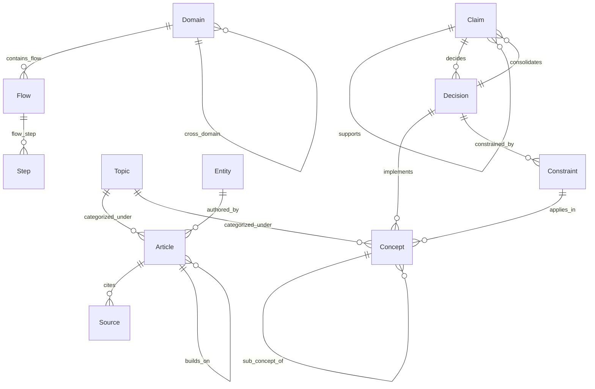
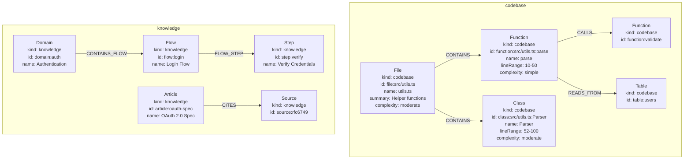
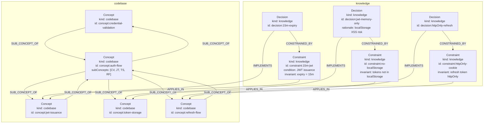

# Neo4j Schema Design

## Overview

This document maps the existing `KnowledgeGraph` JSON structure to Neo4j primitives — nodes with labels, relationships with types, and database organization.

The project currently uses a custom JSON-based graph. The goal is to replace it with Neo4j while preserving all existing node types, edge types, and semantics.

---

## Databases

| Database | Purpose | Kind |
|----------|---------|------|
| `codebase` | Code structure — files, functions, classes, modules, imports, calls | `codebase` |
| `knowledge` | Semantic knowledge — articles, entities, topics, citations, domain flows | `knowledge` |

Neo4j single-instance uses one active database at a time. Both can coexist on the same Neo4j instance; switch between them with `USE`. If running Aura or a cluster, assign each to its own DBMS.

---

## Labeling Convention

Node labels are simple, Neo4j-friendly strings without hierarchical prefixes. Each node carries a `kind` property (`"codebase"` or `"knowledge"`) to distinguish its database origin. This avoids verbose labels like `:Codebase:Code:File` and enables efficient filtering via `WHERE n.kind = "codebase"`.

**Codebase nodes** use labels like `File`, `Function`, `Class`, `Module`, `Concept`, `Config`, `Service`, `Table`, `Endpoint`, `Pipeline`, `Schema`, `Resource`.

**Knowledge nodes** use labels like `Domain`, `Flow`, `Step`, `Article`, `Entity`, `Topic`, `Claim`, `Source`, `Decision`, `Constraint`.

---

## Node Labels

### Codebase Nodes (`kind: "codebase"`)

| Label | Description | Properties |
|-------|-------------|------------|
| `File` | Source file | `id`, `name`, `filePath`, `summary`, `complexity`, `tags[]`, `languageNotes` |
| `Function` | Function definition | `id`, `name`, `filePath`, `lineRange`, `summary`, `complexity`, `tags[]` |
| `Class` | Class definition | `id`, `name`, `filePath`, `lineRange`, `summary`, `complexity`, `tags[]` |
| `Module` | Module or namespace | `id`, `name`, `filePath`, `summary`, `complexity`, `tags[]` |
| `Concept` | Abstract concept in code | `id`, `name`, `summary`, `complexity`, `tags[]` |
| `Config` | Configuration file or entry | `id`, `name`, `filePath`, `summary`, `tags[]` |
| `Service` | External service or API | `id`, `name`, `summary`, `tags[]` |
| `Table` | Database table | `id`, `name`, `summary`, `tags[]` |
| `Endpoint` | HTTP endpoint | `id`, `name`, `filePath`, `summary`, `tags[]` |
| `Pipeline` | Data pipeline | `id`, `name`, `summary`, `tags[]` |
| `Schema` | Data schema | `id`, `name`, `filePath`, `summary`, `tags[]` |
| `Resource` | Infrastructure resource | `id`, `name`, `summary`, `tags[]` |

### Knowledge Nodes (`kind: "knowledge"`)

| Label | Description | Properties |
|-------|-------------|------------|
| `Domain` | Problem domain | `id`, `name`, `summary`, `tags[]` |
| `Flow` | Workflow or process flow | `id`, `name`, `summary`, `tags[]` |
| `Step` | Step in a flow | `id`, `name`, `summary`, `tags[]` |
| `Article` | Article or document | `id`, `name`, `summary`, `tags[]` |
| `Entity` | Named entity | `id`, `name`, `summary`, `tags[]` |
| `Topic` | Topic or subject | `id`, `name`, `summary`, `tags[]` |
| `Claim` | Assertion or claim | `id`, `name`, `summary`, `confidence`, `rationale`, `tags[]` |
| `Source` | Source of knowledge | `id`, `name`, `summary`, `tags[]` |
| `Decision` | Commitment or resolved question | `id`, `name`, `summary`, `rationale`, `status`, `scope`, `tags[]` |
| `Constraint` | Rule or invariant | `id`, `name`, `condition`, `invariant`, `scope`, `tags[]` |

### Shared Node Properties

Every node carries:
- `id: string` — unique node identifier (e.g., `file:src/utils.ts`)
- `name: string` — human-readable label
- `kind: "codebase" | "knowledge"` — database origin, used for filtering
- `summary: string` — LLM-generated description
- `tags: string[]` — arbitrary tags
- `complexity: "simple" | "moderate" | "complex"` — optional; stored as property
- `lineRange: [number, number]` — optional; for code nodes

---

## Relationship Types

Relationships use `:TYPE` syntax. Direction is explicit in Neo4j but can be ignored for undirected traversals using `-[r]-()`.

### Structural Relationships (codebase)

| Type | From | To | Description | Properties |
|------|------|----|-------------|------------|
| `:IMPORTS` | `Module` | `Module` | Module imports another | `weight: float` |
| `:EXPORTS` | `Module` | `*` | Module exports node | `weight: float` |
| `:CONTAINS` | `File` | `Function` / `Class` / `Module` | File contains function/class/module | `weight: float` |
| `:INHERITS` | `Class` | `Class` | Class inheritance | `weight: float` |
| `:IMPLEMENTS` | `Class` | `Class` | Class implements interface | `weight: float` |

### Behavioral Relationships (codebase)

| Type | From | To | Description | Properties |
|------|------|----|-------------|------------|
| `:CALLS` | `Function` | `Function` | Function calls another | `weight: float`, `description: string` |
| `:SUBSCRIBES` | `*` | `Service` | Subscribes to service events | `weight: float` |
| `:PUBLISHES` | `*` | `Service` | Publishes to service | `weight: float` |
| `:MIDDLEWARE` | `Function` | `Function` | Acts as middleware | `weight: float` |

### Data Flow Relationships (codebase)

| Type | From | To | Description | Properties |
|------|------|----|-------------|------------|
| `:READS_FROM` | `*` | `Table` / `Endpoint` | Reads from table/endpoint | `weight: float` |
| `:WRITES_TO` | `*` | `Table` / `Endpoint` | Writes to table/endpoint | `weight: float` |
| `:TRANSFORMS` | `*` | `*` | Transforms data | `weight: float` |
| `:VALIDATES` | `*` | `*` | Validates another | `weight: float` |

### Dependency Relationships (codebase)

| Type | From | To | Description | Properties |
|------|------|----|-------------|------------|
| `:DEPENDS_ON` | `*` | `*` | Depends on another node | `weight: float` |
| `:TESTED_BY` | `*` | `*` | Tested by test node | `weight: float` |
| `:CONFIGURES` | `*` | `Config` | Configures something | `weight: float` |

### Infrastructure Relationships (codebase)

| Type | From | To | Description | Properties |
|------|------|----|-------------|------------|
| `:DEPLOYS` | `*` | `Resource` | Deploys to resource | `weight: float` |
| `:SERVES` | `Endpoint` | `Service` | Endpoint serves service | `weight: float` |
| `:PROVISIONS` | `*` | `Resource` | Provisions resource | `weight: float` |
| `:TRIGGERS` | `*` | `*` | Triggers another action | `weight: float` |

### Schema/Data Relationships (codebase)

| Type | From | To | Description | Properties |
|------|------|----|-------------|------------|
| `:MIGRATES` | `Schema` | `Schema` | Schema migration | `weight: float` |
| `:DOCUMENTS` | `*` | `Config` | Documents config | `weight: float` |
| `:ROUTES` | `Endpoint` | `Endpoint` | Routes to endpoint | `weight: float` |
| `:DEFINES_SCHEMA` | `*` | `Schema` | Defines schema | `weight: float` |

### Domain Relationships (knowledge)

| Type | From | To | Description | Properties |
|------|------|----|-------------|------------|
| `:CONTAINS_FLOW` | `Domain` | `Flow` | Domain contains flow | `weight: float` |
| `:FLOW_STEP` | `Flow` | `Step` | Flow has step | `weight: float` |
| `:CROSS_DOMAIN` | `Domain` | `Domain` | Cross-domain relation | `weight: float` |

### Semantic Relationships (knowledge)

| Type | From | To | Description | Properties |
|------|------|----|-------------|------------|
| `:CITES` | `Article` | `Source` | Article cites source | `weight: float` |
| `:CONTRADICTS` | `Claim` | `Claim` | Contradicts claim | `weight: float` |
| `:BUILDS_ON` | `*` | `*` | Builds on another | `weight: float` |
| `:EXEMPLIFIES` | `*` | `*` | Exemplifies concept | `weight: float` |
| `:CATEGORIZED_UNDER` | `*` | `Topic` | Categorized under topic | `weight: float` |
| `:AUTHORED_BY` | `*` | `Entity` | Authored by entity | `weight: float` |

### Conversation Relationships (knowledge) — PO Chat Extraction

| Type | From | To | Description | Properties |
|------|------|----|-------------|------------|
| `:SUB_CONCEPT_OF` | `Concept` | `Concept` | Part-of composition | `weight: float` |
| `:CONSTRAINED_BY` | `Decision` / `Concept` | `Constraint` | Rule that applies | `weight: float` |
| `:DECIDES` | `Claim` | `Decision` | Claim leads to decision | `weight: float` |
| `:IMPLEMENTS` | `Decision` | `Concept` | Decision fulfills concept | `weight: float` |
| `:SUPPORTS` | `Claim` / `Decision` | `Claim` | Provides evidence for claim | `weight: float` |
| `:APPLIES_IN` | `Constraint` / `Decision` | `Concept` | Scope/context binding | `weight: float` |
| `:CONSOLIDATES` | `Decision` | `Claim` | Decision integrates multiple claims | `weight: float` |

---

## Mermaid Diagrams

### Entity-Relationship Overview (Codebase)

```mermaid
erDiagram
    File ||--o{ Function : contains
    File ||--o{ Class : contains
    File ||--o{ Module : contains
    Module ||--|| Module : imports
    Module ||--o{ Module : exports
    Class ||--o{ Class : inherits
    Class ||--o{ Class : implements
    Function ||--o{ Function : calls
    Function ||--o{ Function : middleware
    Function ||--o{ Service : subscribes
    Function ||--o{ Service : publishes
    Function ||--o{ Endpoint : reads_from
    Function ||--o{ Endpoint : writes_to
    Function ||--o{ Table : reads_from
    Function ||--o{ Table : writes_to
    Function ||--o{ Config : configures
    Function ||--o{ Function : depends_on
    Function ||--o{ Function : tested_by
    Function ||--o{ Resource : deploys
    Function ||--o{ Resource : provisions
    Function ||--o{ Function : triggers
    Endpoint ||--o{ Service : serves
    Endpoint ||--o{ Endpoint : routes
    Schema ||--o{ Schema : migrates
    Function ||--o{ Schema : defines_schema
```

### Entity-Relationship Overview (Knowledge)



### Property Graph Structure



### Tour/Traversal Path

```mermaid
graph LR
    START(("Start")) --> FILE["File<br>kind: codebase<br>main.ts"]
    FILE -->|"CONTAINS"| FN1["Function<br>kind: codebase<br>init"]
    FN1 -->|"CALLS"| FN2["Function<br>kind: codebase<br>authenticate"]
    FN2 -->|"CALLS"| FN3["Function<br>kind: codebase<br>validateToken"]
    FN3 -->|"READS_FROM"| T1["Table<br>kind: codebase<br>users"]
    T1 -->|"WRITES_TO"| T2["Table<br>kind: codebase<br>sessions"]
    FN3 -->|"CALLS"| FN4["Function<br>kind: codebase<br>generateToken"]
    FN4 --> END(("End"))

    style START fill:#2d2d2d,stroke:#d4a574
    style END fill:#2d2d2d,stroke:#d4a574
```



---

## Knowledge Extraction from Conversations

This chapter extends the schema for extracting structured knowledge from multi-turn conversations (Q&A sessions, discussions, design deliberations). The goal is to capture not isolated facts but the **complete, agreed-upon understanding** — everything needed to implement correctly without re-asking questions.

### Guiding Principle

A conversation terminates only when participants share confidence that they understand the topic the same way. At that point, a skill extracts the resulting knowledge into the graph. The schema below is designed to represent that complete understanding.

### Extended Node Types

#### Decision

Captures a commitment to act or a resolved question. Includes the reasoning behind it.

| Property | Type | Description |
|----------|------|-------------|
| `id` | string | Unique identifier |
| `name` | string | Human-readable label |
| `kind` | `"knowledge"` | Always `"knowledge"` |
| `summary` | string | What was decided |
| `rationale` | string | Why this decision was made |
| `status` | `"draft"` \| `"accepted"` \| `"deprecated"` | Lifecycle state |
| `scope` | string[] | Where/when this applies (e.g., service name, feature flag) |
| `tags` | string[] | Arbitrary tags |

#### Constraint

A rule, invariant, or condition that implementation must respect.

| Property | Type | Description |
|----------|------|-------------|
| `id` | string | Unique identifier |
| `name` | string | Human-readable label |
| `kind` | `"knowledge"` | Always `"knowledge"` |
| `condition` | string | Precondition or trigger (e.g., "when token expired") |
| `invariant` | string | What must hold true (e.g., "refresh token must be httpOnly") |
| `scope` | string[] | Where this applies |
| `tags` | string[] | Arbitrary tags |

#### Claim (Extended)

Claims are assertions made during conversation. Extended with confidence tracking.

| Property | Type | Description |
|----------|------|-------------|
| `id` | string | Unique identifier |
| `name` | string | Human-readable label |
| `kind` | `"knowledge"` | Always `"knowledge"` |
| `summary` | string | The assertion |
| `confidence` | `"tentative"` \| `"agreed"` | Whether consensus was reached |
| `rationale` | string | Evidence or reasoning supporting the claim |
| `tags` | string[] | Arbitrary tags |

#### Concept (Extended)

Concepts are extended with compositional structure and constraint references.

| Property | Type | Description |
|----------|------|-------------|
| `id` | string | Unique identifier |
| `name` | string | Human-readable label |
| `kind` | `"codebase"` or `"knowledge"` | Context-dependent |
| `summary` | string | Description |
| `subConcepts` | Concept[] | Parts that compose this concept |
| `constrainedBy` | Constraint[] | Rules this concept must respect |
| `tags` | string[] | Arbitrary tags |

### Example: Auth Flow Knowledge Extraction

Input conversation (truncated for clarity):
> "Auth Flow agreed: user provides credentials → server validates → issues JWT with 15m expiry → client stores in memory, not localStorage → refresh via silent refresh endpoint"
> "localStorage is out because XSS could read it"
> "We use httpOnly cookies for refresh token"

Extracted graph:



---

## Indexes and Constraints

### Required Constraints

```cypher
-- Node ID uniqueness (per database)
CREATE CONSTRAINT codebase_node_id_unique FOR (n:`Codebase`) REQUIRE n.id IS UNIQUE;
CREATE CONSTRAINT knowledge_node_id_unique FOR (n:`Knowledge`) REQUIRE n.id IS UNIQUE;

-- Ensure label consistency (optional, using token lookups)
CREATE CONSTRAINT FOR (n:File) REQUIRE n.filePath IS NOT NULL;
```

### Recommended Indexes

```cypher
-- Kind-filtered indexes for efficient database separation
CREATE INDEX codebase_kind_idx FOR (n) WHERE n.kind = "codebase" ON (n.id);
CREATE INDEX knowledge_kind_idx FOR (n) WHERE n.kind = "knowledge" ON (n.id);

-- By name for search
CREATE INDEX codebase_name_idx FOR (n) WHERE n.kind = "codebase" ON (n.name);
CREATE INDEX knowledge_name_idx FOR (n) WHERE n.kind = "knowledge" ON (n.name);

-- By complexity for filtering
CREATE INDEX codebase_complexity_idx FOR (n) WHERE n.kind = "codebase" ON (n.complexity);
CREATE INDEX knowledge_complexity_idx FOR (n) WHERE n.kind = "knowledge" ON (n.complexity);

-- By tag for filtering
CREATE INDEX codebase_tags_idx FOR (n) WHERE n.kind = "codebase" ON (n.tags);
CREATE INDEX knowledge_tags_idx FOR (n) WHERE n.kind = "knowledge" ON (n.tags);
```

### Relationship Indexes

```cypher
-- Speed up traversals by relationship type
CREATE INDEX rel_type_idx FOR ()-[r]-() ON (type(r));

-- Composite for weighted traversals
CREATE INDEX rel_weight_idx FOR ()-[r]-() ON (r.weight);
```

---

## Data Migration Notes

### JSON → Neo4j Mapping

| JSON Field | Neo4j Equivalent |
|------------|------------------|
| `nodes[].type` | Node label (simple label, e.g., `File`, `Claim`) |
| `nodes[].kind` | Added as property: `"codebase"` or `"knowledge"` |
| `edges[].type` | Relationship type (`:TYPE`) |
| `edges[].source` | Start node |
| `edges[].target` | End node |
| `edges[].weight` | Relationship property `weight` |
| `edges[].direction` | Neo4j relationship direction (or ignore if bidirectional) |
| `layers` | Separate `:Layer` nodes with `:MEMBER_OF` relationships |
| `tour` | Ordered array → path traversal query |

### Batch Import

Use `LOAD CSV` or Neo4j's `apoc.periodic.iterate` for bulk imports from the existing JSON format.

---

## Query Patterns

### Find shortest path (BFS equivalent)

```cypher
MATCH path = shortestPath((start {id: $startId})-[*]->(end {id: $endId}))
RETURN path
```

### Louvain community detection

```cypher
CALL gds.louvain.stream('my-graph', { relationshipWeightProperty: 'weight' })
YIELD nodeId, communityId
RETURN communityId, collect(gds.util.asNode(nodeId).name) AS members
```

### Topological sort for tours (Kahn's algorithm)

```cypher
-- Kahn's via collect + remove
MATCH (n)
WHERE NOT ()-->(n) AND n.kind = "codebase"
WITH n ORDER BY n.id
MATCH (n)-[r]->(m)
RETURN n.id AS sorted
```

### Filter by kind and complexity

```cypher
-- Find all complex functions in codebase
MATCH (n:Function)
WHERE n.kind = "codebase" AND n.complexity = 'complex' AND 'security' IN n.tags
RETURN n

-- Find all decisions in knowledge graph
MATCH (n:Decision)
WHERE n.kind = "knowledge"
RETURN n
```

### Find all decisions for a concept

```cypher
MATCH (d:Decision)-[:IMPLEMENTS]->(c:Concept {id: $conceptId})
WHERE d.kind = "knowledge" AND c.kind = "codebase"
RETURN d
```

### Get full context of a decision (constraints, supporting claims)

```cypher
MATCH (d:Decision {id: $decisionId})
WHERE d.kind = "knowledge"
OPTIONAL MATCH (d)-[:CONSTRAINED_BY]->(c:Constraint)
OPTIONAL MATCH (supporter:Claim)-[:SUPPORTS]->(d)
RETURN d, c, supporter
```

### Trace concept composition

```cypher
MATCH path = (c:Concept {id: $conceptId})-[:SUB_CONCEPT_OF*]->(sub:Concept)
WHERE c.kind = "codebase"
RETURN path
```

### Find constraints for a scope

```cypher
MATCH (c:Constraint)
WHERE c.kind = "knowledge" AND $scope IN c.scope
RETURN c
```

### Cross-database traversal with kind filtering

```cypher
-- Find knowledge nodes related to a codebase concept
MATCH (c:Concept {id: $conceptId})
WHERE c.kind = "codebase"
MATCH (c)-[r]-(n)
WHERE n.kind = "knowledge"
RETURN n, type(r) AS relationship
```