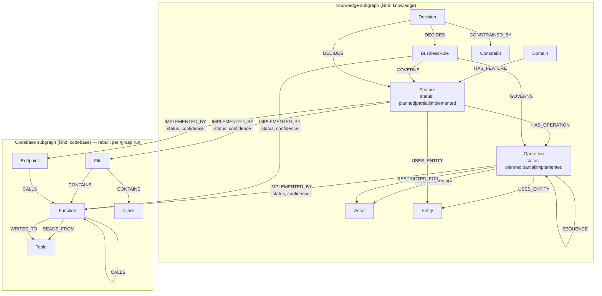

# Neo4j Schema Design

## Purpose

Grasp-It builds two complementary knowledge graphs stored in a **single Neo4j database**:

- **Codebase subgraph** — structural facts extracted from source code: files, functions, classes,
  modules, imports, calls. Generated deterministically by `/grasp` scripts, no LLM required for
  structure (LLM adds summaries only). Rebuilt on every `/grasp` run.

- **Knowledge subgraph** — product and domain knowledge: business domains, features, operations,
  actors, business rules, decisions, and constraints. Populated by:
  - `/grasp-domain` — mines domain and feature knowledge from the codebase
  - `/grasp-requirements` — interviews the Product Owner to distil planned feature knowledge

The knowledge subgraph stores knowledge of two kinds:
- **Implemented** — what the codebase currently does, extracted by analysis
- **Planned** — what the PO envisions for a new or changed feature, extracted from interviews

Both subgraphs are used together to create tasks, build implementation plans, design test cases,
and drive implementation. The `IMPLEMENTED_BY` relationship bridges them — tracing a planned
feature or operation directly to the code that realizes it.

---

## Single Database Strategy

**One Neo4j database. Two logical subgraphs. Separated by the `kind` node property.**

The `kind` property (`"codebase"` or `"knowledge"`) acts as the logical separator. All indexes
are `kind`-scoped. The primary use case — "which files implement this feature?" and its reverse
"which features touch this file?" — requires `IMPLEMENTED_BY` to be a native Neo4j relationship
traversable in both directions. That is only possible within a single database.

### Rebuild pattern

The codebase subgraph is rebuilt on every `/grasp` run:

```cypher
-- Wipe codebase nodes and all their relationships
MATCH (n) WHERE n.kind = "codebase" DETACH DELETE n
```

Knowledge nodes survive because the wipe is scoped by `kind`. The `IMPLEMENTED_BY`
relationships are rewritten after each rebuild by re-linking knowledge nodes to their new
codebase counterparts (matched by `id`).

---

## Labeling Convention

Node labels are simple, Neo4j-friendly strings. Each node carries a `kind` property
(`"codebase"` or `"knowledge"`) to distinguish its subgraph origin.

**Codebase nodes** use labels: `File`, `Function`, `Class`, `Module`, `Config`,
`Table`, `Endpoint`.

**Knowledge nodes** use labels: `Domain`, `Feature`, `Actor`, `BusinessRule`, `Operation`,
`Entity`, `Decision`, `Constraint`.

---

## Node Labels

### Codebase Nodes (`kind: "codebase"`)

Populated by `extract-structure.mjs` (tree-sitter, deterministic) + LLM summaries.

| Label | Description | Properties |
|-------|-------------|------------|
| `File` | Source file | `id`, `name`, `filePath`, `summary`, `complexity`, `tags[]`, `languageNotes` |
| `Function` | Function definition | `id`, `name`, `filePath`, `lineRange`, `summary`, `complexity`, `tags[]` |
| `Class` | Class definition | `id`, `name`, `filePath`, `lineRange`, `summary`, `complexity`, `tags[]` |
| `Module` | Module or namespace | `id`, `name`, `filePath`, `summary`, `complexity`, `tags[]` |
| `Config` | Configuration file or entry | `id`, `name`, `filePath`, `summary`, `tags[]` |
| `Table` | Database table | `id`, `name`, `summary`, `tags[]` |
| `Endpoint` | HTTP endpoint | `id`, `name`, `filePath`, `method`, `path`, `summary`, `tags[]` |

### Knowledge Nodes (`kind: "knowledge"`)

#### Business Layer — populated by `/grasp-domain` and `/grasp-requirements`

| Label | Description | Properties |
|-------|-------------|------------|
| `Domain` | Product domain or area | `id`, `name`, `summary`, `tags[]` |
| `Feature` | Named product feature | `id`, `name`, `summary`, `status`, `tags[]` |
| `Actor` | User role or system agent | `id`, `name`, `summary`, `permissions[]`, `restrictions[]`, `tags[]` |
| `BusinessRule` | High-level business policy | `id`, `name`, `summary`, `ruleText`, `status`, `scope[]`, `tags[]` |
| `Operation` | A meaningful action within a feature | `id`, `name`, `summary`, `status`, `tags[]` |
| `Entity` | Named business object (e.g. Invoice, Interview) | `id`, `name`, `summary`, `tags[]` |

#### PO Interview Layer — populated by `/grasp-requirements`

| Label | Description | Properties |
|-------|-------------|------------|
| `Decision` | Commitment or resolved question | `id`, `name`, `summary`, `rationale`, `status`, `scope[]`, `tags[]` |
| `Constraint` | Technical invariant or access condition | `id`, `name`, `condition`, `invariant`, `scope[]`, `tags[]` |

### Key Property Values

**`Feature.status` / `Operation.status`:**

| Value | Meaning |
|-------|---------|
| `"planned"` | PO described it; no implementation exists yet |
| `"partial"` | Some implementation exists but does not fully match PO intent |
| `"implemented"` | Codebase fully realizes it |

**`BusinessRule.status`:** `"active"` | `"deprecated"` | `"proposed"`

**`Decision.status`:** `"draft"` | `"accepted"` | `"deprecated"`

**`IMPLEMENTED_BY.status`:** `"legacy"` | `"target"` | `"shared"` | `"planned"`

### Shared Node Properties

Every node carries:
- `id: string` — unique identifier (e.g. `feature:interview-scheduling`, `file:src/utils.ts`)
- `name: string` — human-readable label
- `kind: "codebase" | "knowledge"` — subgraph origin
- `summary: string` — LLM-generated description
- `tags: string[]` — arbitrary tags
- `complexity: "simple" | "moderate" | "complex"` — optional
- `lineRange: [number, number]` — optional; code nodes only

---

## Relationship Types

### Structural Relationships (codebase)

| Type | From | To | Description | Properties |
|------|------|----|-------------|------------|
| `:CONTAINS` | `File` | `Function` / `Class` / `Module` | File contains definition | `weight: float` |
| `:IMPORTS` | `Module` | `Module` | Module imports another | `weight: float` |
| `:EXPORTS` | `Module` | `*` | Module exports node | `weight: float` |
| `:INHERITS` | `Class` | `Class` | Class inheritance | `weight: float` |
| `:IMPLEMENTS` | `Class` | `Class` | Class implements interface | `weight: float` |

### Behavioral Relationships (codebase)

| Type | From | To | Description | Properties |
|------|------|----|-------------|------------|
| `:CALLS` | `Function` | `Function` | Function calls another | `weight: float`, `description: string` |
| `:READS_FROM` | `Function` | `Table` / `Endpoint` | Reads from data source | `weight: float` |
| `:WRITES_TO` | `Function` | `Table` / `Endpoint` | Writes to data source | `weight: float` |
| `:CONFIGURES` | `*` | `Config` | Configures something | `weight: float` |
| `:TESTED_BY` | `*` | `*` | Tested by test node | `weight: float` |
| `:DEPENDS_ON` | `*` | `*` | Depends on another node | `weight: float` |

### Product and Business Relationships (knowledge)

| Type | From | To | Description | Properties |
|------|------|----|-------------|------------|
| `:HAS_FEATURE` | `Domain` | `Feature` | Domain owns a feature | `weight: float` |
| `:HAS_OPERATION` | `Feature` | `Operation` | Feature contains an operation | `weight: float` |
| `:SEQUENCE` | `Operation` | `Operation` | This operation precedes the target | `weight: float` |
| `:PERFORMED_BY` | `Operation` | `Actor` | Operation is performed by this actor | `weight: float` |
| `:RESTRICTED_FOR` | `Operation` | `Actor` | Operation is forbidden for this actor | `weight: float` |
| `:GOVERNS` | `BusinessRule` | `Feature` / `Operation` | Rule governs feature or operation | `weight: float` |
| `:USES_ENTITY` | `Feature` / `Operation` | `Entity` | Feature/operation works with an entity | `weight: float` |

### PO Interview Relationships (knowledge)

| Type | From | To | Description | Properties |
|------|------|----|-------------|------------|
| `:CONSTRAINED_BY` | `Decision` / `Feature` / `BusinessRule` | `Constraint` | Rule that applies | `weight: float` |
| `:DECIDES` | `Decision` | `Feature` / `BusinessRule` | Decision resolves this | `weight: float` |

### Bridge Relationship (knowledge → codebase, native within single DB)

| Type | From | To | Description | Properties |
|------|------|----|-------------|------------|
| `:IMPLEMENTED_BY` | `Feature` / `Operation` / `BusinessRule` | `File` / `Function` / `Class` / `Endpoint` | Business concept realized in code | `status: string`, `confidence: float` |

`status` values: `"legacy"` | `"target"` | `"shared"` | `"planned"`

---

## Schema Diagram



---

## Key Query Patterns

### What code implements a feature?

```cypher
MATCH (f:Feature {id: $featureId})-[r:IMPLEMENTED_BY]->(code)
WHERE f.kind = "knowledge"
RETURN labels(code) AS codeType, code.name, code.filePath, r.status, r.confidence
ORDER BY r.confidence DESC
```

### Which features touch a file?

```cypher
MATCH (code:File {filePath: $filePath})<-[:IMPLEMENTED_BY]-(n)
WHERE code.kind = "codebase"
RETURN labels(n) AS kind, n.name, n.status
```

### Full operation map for a feature

```cypher
MATCH (f:Feature {id: $featureId})-[:HAS_OPERATION]->(op:Operation)
WHERE f.kind = "knowledge"
OPTIONAL MATCH (op)-[:PERFORMED_BY]->(a:Actor)
OPTIONAL MATCH (op)-[:RESTRICTED_FOR]->(ra:Actor)
OPTIONAL MATCH (br:BusinessRule)-[:GOVERNS]->(op)
OPTIONAL MATCH (op)-[r:IMPLEMENTED_BY]->(code)
RETURN op.name, op.status,
       collect(DISTINCT a.name) AS performers,
       collect(DISTINCT ra.name) AS restricted,
       collect(DISTINCT br.name) AS rules,
       collect(DISTINCT {type: labels(code)[0], name: code.name, status: r.status}) AS impl
ORDER BY op.name
```

### All planned features in a domain

```cypher
MATCH (d:Domain {id: $domainId})-[:HAS_FEATURE]->(f:Feature)
WHERE f.status = "planned"
RETURN f.name, f.summary
```

### Planned vs implemented split

```cypher
MATCH (d:Domain {id: $domainId})-[:HAS_FEATURE]->(f:Feature)
RETURN f.status AS status, count(f) AS count
ORDER BY status
```

### All decisions and constraints for a feature

```cypher
MATCH (f:Feature {id: $featureId})
OPTIONAL MATCH (dc:Decision)-[:DECIDES]->(f)
OPTIONAL MATCH (f)-[:CONSTRAINED_BY]->(cn:Constraint)
OPTIONAL MATCH (br:BusinessRule)-[:GOVERNS]->(f)
RETURN f, collect(DISTINCT dc) AS decisions,
       collect(DISTINCT cn) AS constraints,
       collect(DISTINCT br) AS rules
```

### Find all complex functions related to a domain

```cypher
MATCH (d:Domain {id: $domainId})-[:HAS_FEATURE]->(:Feature)-[:IMPLEMENTED_BY]->(f:Function)
WHERE f.kind = "codebase" AND f.complexity = "complex"
RETURN f.name, f.filePath, f.summary
```

---

## Indexes and Constraints

### Required Constraints

```cypher
CREATE CONSTRAINT node_id_unique FOR (n:_Node_) REQUIRE n.id IS UNIQUE;
```

Create per-label:
```cypher
CREATE CONSTRAINT file_id FOR (n:File) REQUIRE n.id IS UNIQUE;
CREATE CONSTRAINT function_id FOR (n:Function) REQUIRE n.id IS UNIQUE;
CREATE CONSTRAINT class_id FOR (n:Class) REQUIRE n.id IS UNIQUE;
CREATE CONSTRAINT feature_id FOR (n:Feature) REQUIRE n.id IS UNIQUE;
CREATE CONSTRAINT operation_id FOR (n:Operation) REQUIRE n.id IS UNIQUE;
CREATE CONSTRAINT domain_id FOR (n:Domain) REQUIRE n.id IS UNIQUE;
CREATE CONSTRAINT actor_id FOR (n:Actor) REQUIRE n.id IS UNIQUE;
CREATE CONSTRAINT businessrule_id FOR (n:BusinessRule) REQUIRE n.id IS UNIQUE;
CREATE CONSTRAINT decision_id FOR (n:Decision) REQUIRE n.id IS UNIQUE;
CREATE CONSTRAINT constraint_id FOR (n:Constraint) REQUIRE n.id IS UNIQUE;
```

### Recommended Indexes

```cypher
-- Kind separation
CREATE INDEX kind_idx FOR (n) ON (n.kind);

-- Name search
CREATE INDEX codebase_name FOR (n) WHERE n.kind = "codebase" ON (n.name);
CREATE INDEX knowledge_name FOR (n) WHERE n.kind = "knowledge" ON (n.name);

-- Status filtering (planned vs implemented)
CREATE INDEX feature_status FOR (n:Feature) ON (n.status);
CREATE INDEX operation_status FOR (n:Operation) ON (n.status);

-- Complexity filtering
CREATE INDEX function_complexity FOR (n:Function) ON (n.complexity);

-- Tag filtering
CREATE INDEX codebase_tags FOR (n) WHERE n.kind = "codebase" ON (n.tags);
CREATE INDEX knowledge_tags FOR (n) WHERE n.kind = "knowledge" ON (n.tags);

-- Relationship traversal
CREATE INDEX rel_weight FOR ()-[r]-() ON (r.weight);
```

---

## Node ID Conventions

| Label | ID format | Example |
|-------|-----------|---------|
| `File` | `file:<relative-path>` | `file:src/auth/login.ts` |
| `Function` | `function:<path>:<name>` | `function:src/auth/login.ts:validate` |
| `Class` | `class:<path>:<name>` | `class:src/auth/AuthService.ts:AuthService` |
| `Endpoint` | `endpoint:<method>:<path>` | `endpoint:POST:/api/interviews` |
| `Table` | `table:<name>` | `table:users` |
| `Domain` | `domain:<kebab-name>` | `domain:auth` |
| `Feature` | `feature:<kebab-name>` | `feature:interview-scheduling` |
| `Operation` | `operation:<kebab-name>` | `operation:send-invitation` |
| `Actor` | `actor:<kebab-name>` | `actor:agency-user` |
| `BusinessRule` | `business-rule:<kebab-name>` | `business-rule:manager-approval-only` |
| `Entity` | `entity:<kebab-name>` | `entity:interview` |
| `Decision` | `decision:<kebab-name>` | `decision:jwt-memory-only` |
| `Constraint` | `constraint:<kebab-name>` | `constraint:no-localstorage` |
