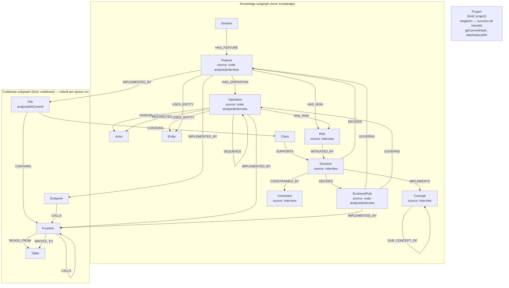

# Graph Architecture

## Overview

Grasp-It builds two complementary knowledge graphs stored in a **single Neo4j database**, logically separated by the `kind` node property:

- **Codebase subgraph** (`kind: "codebase"`) — structural facts extracted from source code by deterministic scripts (tree-sitter, regex). LLM adds summaries only.
- **Knowledge subgraph** (`kind: "knowledge"`) — business and product knowledge extracted by LLM from codebase signals and PO interviews. Knowledge nodes carry a `source` property (`"code-analysis"` | `"interview"` | `"wiki"`) that records which skill produced them, distinguishing implemented facts from specialist-described intent.

The `IMPLEMENTED_BY` bridge relationship connects the two subgraphs, enabling queries like "which files implement this feature?" and "which features touch this file?" natively in Neo4j.

## Node Types

### Project Node (`kind: "project"`)

A **singleton** node that holds project-level metadata. There is exactly one per Neo4j database. It is excluded from codebase wipes (the wipe query is scoped to `kind = "codebase"`) and therefore persists across all `/grasp` runs.

| Label | Description | ID format |
|-------|-------------|-----------|
| `Project` | Project-level metadata singleton | `project:singleton` |

Key properties: `gitCommitHash`, `lastAnalyzedAt`, `version`, `analyzedFiles`.

This node is the shared, authoritative source of the last-analyzed commit hash in multi-user Neo4j setups. It replaces the local-only `.grasp-it/meta.json` as the canonical commit anchor.

### Codebase Nodes (`kind: "codebase"`)

Generated by `extract-structure.mjs` and `extract-import-map.mjs` (tree-sitter, deterministic):

| Label | Description | ID format |
|-------|-------------|-----------|
| `File` | Source file | `file:<relative-path>` |
| `Function` | Function definition | `function:<path>:<name>` |
| `Class` | Class definition | `class:<path>:<name>` |
| `Module` | Module or namespace | `module:<path>:<name>` |
| `Config` | Configuration file | `config:<path>` |
| `Table` | Database table | `table:<name>` |
| `Endpoint` | HTTP endpoint | `endpoint:<method>:<path>` |

`File` nodes carry an `analyzedAtCommit` property — the git commit hash at which this file was last re-analyzed. This enables staleness detection for knowledge nodes whose `IMPLEMENTED_BY` edges point to files that have since been updated at a newer commit.

### Knowledge Nodes (`kind: "knowledge"`)

Generated by domain-analyzer agent (`/grasp-domain`) and PO interview (`/grasp-requirements`).

**Business Layer** — produced by either `/grasp-domain` (`source: "code-analysis"`) or `/grasp-requirements` (`source: "interview"`):

| Label | Description | ID format |
|-------|-------------|-----------|
| `Domain` | Product domain or area | `domain:<kebab-name>` |
| `Feature` | Named product capability | `feature:<kebab-name>` |
| `Operation` | A meaningful action within a feature | `operation:<kebab-name>` |
| `Actor` | User role or system agent | `actor:<kebab-name>` |
| `BusinessRule` | High-level business policy | `business-rule:<kebab-name>` |
| `Entity` | Named business object | `entity:<kebab-name>` |

**PO Interview Layer** — produced only by `/grasp-requirements` (`source: "interview"`):

| Label | Description | ID format |
|-------|-------------|-----------|
| `Decision` | Resolved question or commitment | `decision:<kebab-name>` |
| `Constraint` | Technical invariant or access condition | `constraint:<kebab-name>` |
| `Concept` | Key abstraction named by the specialist | `concept:<kebab-name>` |
| `Claim` | Assertion from the interview (`confidence: tentative\|agreed`) | `claim:<short-uuid>` |
| `Risk` | Potential negative outcome — hazard, pitfall, customer exposure (`severity: low\|medium\|high\|critical`) | `risk:<kebab-name>` |

## Relationships

### Codebase Relationships

| Type | From | To | Description |
|------|------|----|-------------|
| `:CONTAINS` | File | Function/Class/Module | File contains definition |
| `:IMPORTS` | Module | Module | Module imports another |
| `:EXPORTS` | Module | * | Module exports node |
| `:INHERITS` | Class | Class | Class inheritance |
| `:IMPLEMENTS` | Class | Class | Class implements interface |
| `:CALLS` | Function | Function | Function calls another |
| `:READS_FROM` | Function | Table/Endpoint | Reads from data source |
| `:WRITES_TO` | Function | Table/Endpoint | Writes to data source |
| `:CONFIGURES` | * | Config | Configures something |
| `:TESTED_BY` | * | * | Tested by test node |
| `:DEPENDS_ON` | * | * | Depends on another node |

### Knowledge Relationships

| Type | From | To | Description |
|------|------|----|-------------|
| `:HAS_FEATURE` | Domain | Feature | Domain owns a feature |
| `:HAS_OPERATION` | Feature | Operation | Feature contains an operation |
| `:SEQUENCE` | Operation | Operation | Precedes target operation |
| `:PERFORMED_BY` | Operation | Actor | Performed by this actor |
| `:RESTRICTED_FOR` | Operation | Actor | Forbidden for this actor |
| `:GOVERNS` | BusinessRule | Feature/Operation | Rule governs feature/operation |
| `:USES_ENTITY` | Feature/Operation | Entity | Works with an entity |
| `:CONSTRAINED_BY` | Decision/Feature/BusinessRule/Concept | Constraint | Rule applies |
| `:DECIDES` | Decision | Feature/BusinessRule | Decision resolves this |
| `:SUB_CONCEPT_OF` | Concept | Concept | Concept is a sub-part of another |
| `:IMPLEMENTS` | Decision | Concept | Decision fulfills a concept |
| `:SUPPORTS` | Claim | Claim/Decision | Evidence chain |
| `:APPLIES_IN` | Constraint/BusinessRule/Risk | Concept/Feature/Operation | Scopes a rule or risk to a context |
| `:HAS_RISK` | Feature/Operation/BusinessRule/Concept | Risk | Associated risk |
| `:MITIGATED_BY` | Risk | Decision/Constraint | Decision or constraint that addresses this risk |

### Bridge Relationship

| Type | From | To | Description |
|------|------|----|-------------|
| `:IMPLEMENTED_BY` | Feature/Operation/BusinessRule | File/Function/Class/Endpoint | Business concept realized in code |

Properties: `status: "legacy"|"target"|"shared"|"planned"`, `confidence: float`

## Graph Diagram



## Rebuild Pattern

The codebase subgraph is wiped and rebuilt on every `/grasp` run:

```cypher
MATCH (n) WHERE n.kind = "codebase" DETACH DELETE n
```

Knowledge nodes (`kind: "knowledge"`) and the `Project` singleton (`kind: "project"`) survive because the wipe is scoped by `kind`.
`IMPLEMENTED_BY` relationships are rewritten after each rebuild.

After each incremental update, the `Project` singleton is updated:

```cypher
MERGE (p:Project {id: "project:singleton"})
SET p.gitCommitHash = $gitCommitHash,
    p.lastAnalyzedAt = $lastAnalyzedAt,
    p.analyzedFiles  = $analyzedFiles,
    p.kind           = "project"
```

## Key Query Patterns

See [`docs/architecture/neo4j-schema.md`](docs/architecture/neo4j-schema.md) for full query examples.