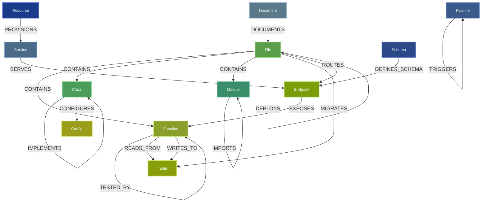
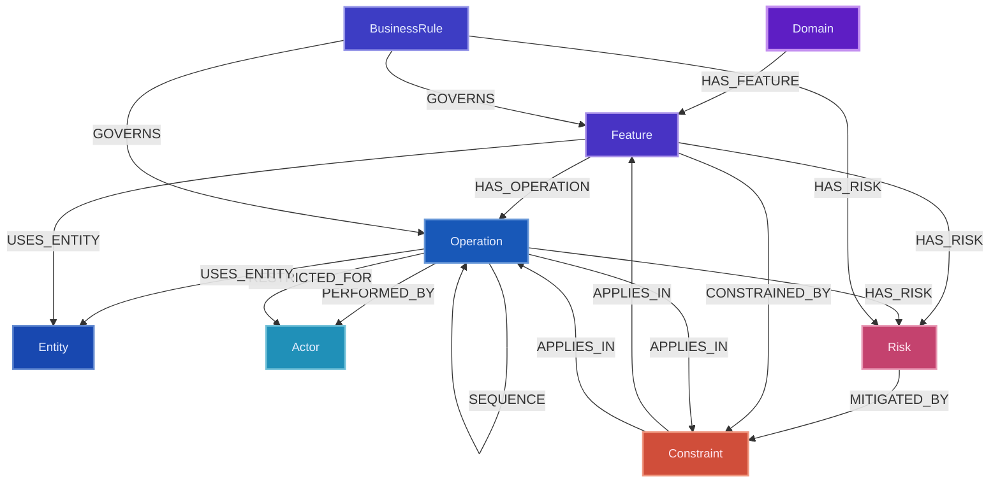
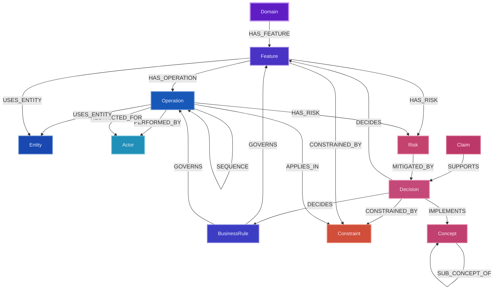

# Graph Architecture

## Overview

Grasp-It builds two complementary knowledge graphs stored in a **single Neo4j database**, logically separated by the `kind` node property:

- **Codebase subgraph** (`kind: "codebase"`) — structural facts extracted from source code by deterministic scripts (tree-sitter, regex). LLM adds summaries only.
- **Knowledge subgraph** (`kind: "knowledge"`) — business and product knowledge extracted by LLM from codebase signals and PO interviews. Knowledge nodes carry a `source` property (`"code-analysis"` | `"interview"` | `"wiki"`) that records which skill produced them, distinguishing implemented facts from specialist-described intent.

The `IMPLEMENTED_BY` bridge relationship connects the two subgraphs, enabling queries like "which files implement this feature?" and "which features touch this file?" natively in Neo4j.

## Node Types

## Freshness Metadata

Every knowledge node carries `generatedAt` (ISO 8601 timestamp) — when the node was created or last refreshed.

Code-analysis nodes additionally carry:

| Property | Type | Description |
|----------|------|-------------|
| `sourceCommit` | string (git hash) | Git commit hash at which this node was derived from code. Present only on `source: "code-analysis"` nodes. |
| `sourceFiles` | string[] | Files analyzed to derive this knowledge node. Present only on `source: "code-analysis"` nodes. |

Interview nodes (`source: "interview"`) carry `generatedAt` and `author` — they have no `sourceCommit` or `sourceFiles`. The `author` field records the name or role of the specialist who provided the knowledge.

These properties enable:
- Per-node staleness detection: compare `sourceCommit` against current HEAD to determine if a code-analysis node's underlying code has changed
- Prioritization: `generatedAt` allows re-analysis to proceed oldest-first
- Auditability: trace when each piece of knowledge was extracted, and (for code-analysis nodes) from which commit and files
- Source attribution: `author` traces interview knowledge back to its specialist

### Project Node (`kind: "project"`)

A **singleton** node that holds project-level metadata. There is exactly one per Neo4j database. It is excluded from codebase wipes (the wipe query is scoped to `kind = "codebase"`) and therefore persists across all `/grasp` runs.

| Label | Description | ID format |
|-------|-------------|-----------|
| `Project` | Project-level metadata singleton | `project:singleton` |

Key properties: `gitCommitHash`, `lastAnalyzedAt`, `version`, `analyzedFiles`.

This node is the shared, authoritative source of the last-analyzed commit hash in multi-user Neo4j setups. It replaces the local-only `.grasp-it/meta.json` as the canonical commit anchor.

### Codebase Nodes (`kind: "codebase"`)

Generated by `extract-structure.mjs` and `extract-import-map.mjs` (tree-sitter, deterministic):

| Label | Description | ID format |
|-------|-------------|-----------|
| `File` | Source file | `file:<relative-path>` |
| `Function` | Function definition | `function:<path>:<name>` |
| `Class` | Class definition | `class:<path>:<name>` |
| `Module` | Module or namespace | `module:<path>:<name>` |
| `Config` | Configuration file | `config:<path>` |
| `Table` | Database table | `table:<name>` |
| `Endpoint` | HTTP endpoint | `endpoint:<method>:<path>` |

`File` nodes carry an `analyzedAtCommit` property — the git commit hash at which this file was last re-analyzed. This enables staleness detection for knowledge nodes whose `IMPLEMENTED_BY` edges point to files that have since been updated at a newer commit.

### Knowledge Nodes (`kind: "knowledge"`)

Generated by domain-analyzer agent (`/grasp-domain`) and PO interview (`/grasp-interview`).

All knowledge nodes carry `generatedAt` (ISO 8601 timestamp). Nodes from code analysis additionally carry `sourceCommit` and `sourceFiles`; interview nodes do not.

#### Nodes by Source

**Code-analysis nodes** (`source: "code-analysis"`) — produced by `/grasp-domain`:

| Label | Description | ID format | Key properties |
|-------|-------------|-----------|-----------------|
| `Domain` | Product domain or area | `domain:<kebab-name>` | `generatedAt`, `sourceCommit`, `sourceFiles` |
| `Feature` | Named product capability | `feature:<kebab-name>` | `generatedAt`, `sourceCommit`, `sourceFiles` |
| `Operation` | A meaningful action within a feature | `operation:<kebab-name>` | `generatedAt`, `sourceCommit`, `sourceFiles` |
| `Actor` | User role or system agent | `actor:<kebab-name>` | `generatedAt`, `sourceCommit`, `sourceFiles` |
| `BusinessRule` | High-level business policy | `business-rule:<kebab-name>` | `generatedAt`, `sourceCommit`, `sourceFiles` |
| `Entity` | Named business object | `entity:<kebab-name>` | `generatedAt`, `sourceCommit`, `sourceFiles` |
| `Risk` | Potential negative outcome (code-visible hazard) | `risk:<kebab-name>` | `generatedAt`, `sourceCommit`, `sourceFiles` |
| `Constraint` | Technical invariant or access condition | `constraint:<kebab-name>` | `generatedAt`, `sourceCommit`, `sourceFiles` |

**Interview nodes** (`source: "interview"`) — produced by `/grasp-interview`. The same node types can appear; only the `source` property differs. Interview nodes do NOT carry `sourceCommit` or `sourceFiles`.

#### Node Reuse Guidelines for Interviews

During an interview, the skill must check the graph before creating new nodes:

| Node type | Behavior in interview |
|-----------|----------------------|
| `Domain` | **Reuse existing.** In 95%+ of interviews the domain already exists. Find it in the graph and attach the feature to it directly (new feature) or indirectly (via an existing feature). Create a new domain only in extreme cases. |
| `Feature` | **Reuse existing or create new.** If the interview is about a new feature, create it. If about an existing feature, find and extend it. |
| `Operation` | **Check existing.** If the interviewed user mentions an operation concept already in the graph, reuse it. Otherwise create a new one. |
| `Actor` | **Check existing.** Reuse known actors from the graph. Create new actors only if genuinely new roles are discovered. |
| `BusinessRule` | **Can be created.** One of the most important nodes for business logic. |
| `Entity` | **Check existing.** Ambiguous, duplicate, or synonym entities should be avoided. Check the graph for similar entities and ask the user if it's the same or different. |
| `Risk` | **Can be created.** Both code-visible and specialist-identified risks are stored the same way. |
| `Constraint` | **Can be created.** Technical invariants or access conditions stated during interview. |
| `Decision` | **Interview-specific.** Created only during interviews. Resolved questions and commitments. |
| `Concept` | **Interview-specific.** Key abstractions named by the specialist. |
| `Claim` | **Interview-specific.** Assertions from the interview (`confidence: tentative\|agreed`). |

**Interview-specific nodes** (only from `/grasp-interview`): `Decision`, `Concept`, `Claim`.

**Critical nodes for graph connectivity**: `Domain` and `Feature` must always be connected — they form the backbone of the graph structure.

## Relationships

### Codebase Relationships

| Type | From | To | Description |
|------|------|----|-------------|
| `:CONTAINS` | File | Function/Class/Module | File contains definition |
| `:IMPORTS` | Module | Module | Module imports another |
| `:EXPORTS` | Module | * | Module exports node |
| `:INHERITS` | Class | Class | Class inheritance |
| `:IMPLEMENTS` | Class | Class | Class implements interface |
| `:CALLS` | Function | Function | Function calls another function |
| `:EXPOSES` | Endpoint | Function | HTTP endpoint exposes its handler function |
| `:READS_FROM` | Function | Table/Endpoint | Reads from data source |
| `:WRITES_TO` | Function | Table/Endpoint | Writes to data source |
| `:TRANSFORMS` | Function | Table/Endpoint | Transforms/processes data |
| `:VALIDATES` | Function | * | Validates data or input |
| `:CONFIGURES` | * | Config | Configures something |
| `:TESTED_BY` | * | * | Tested by test node |
| `:DEPENDS_ON` | * | * | Depends on another node |
| `:RELATED` | * | * | Topically related without a specific structural relationship |
| `:SIMILAR_TO` | * | * | Structurally or semantically similar |
| `:SUBSCRIBES` | Function | * | Subscribes to events or messages |
| `:PUBLISHES` | Function | * | Publishes events or messages |
| `:MIDDLEWARE` | Function | Function | Middleware wraps another handler |
| `:DOCUMENTS` | Document/File | File | Doc file describes code |
| `:DEPLOYS` | File | File | Infra file deploys code |
| `:MIGRATES` | File | Table | SQL migration modifies table |
| `:TRIGGERS` | Pipeline | Pipeline | CI config triggers pipeline |
| `:DEFINES_SCHEMA` | Schema | * | Schema file defines structure |
| `:SERVES` | Service | Endpoint | K8s/container service exposes endpoint |
| `:PROVISIONS` | Resource | * | Terraform/IaC creates infrastructure |
| `:ROUTES` | File | Endpoint | Routing config directs traffic |

> **Note on Class methods:** Class methods are NOT stored as separate `Function` nodes. They are stored as a `methods: string[]` property on the `Class` node. There is no `Class→Function` edge in the graph. To find functions defined in the same file as a class, match by `cls.filePath`.

### Knowledge Relationships

| Type | From | To | Description |
|------|------|----|-------------|
| `:HAS_FEATURE` | Domain | Feature | Domain owns a feature |
| `:HAS_OPERATION` | Feature | Operation | Feature contains an operation |
| `:SEQUENCE` | Operation | Operation | Precedes target operation |
| `:PERFORMED_BY` | Operation | Actor | Performed by this actor |
| `:RESTRICTED_FOR` | Operation | Actor | Forbidden for this actor |
| `:GOVERNS` | BusinessRule | Feature/Operation | Rule governs feature/operation |
| `:USES_ENTITY` | Feature/Operation | Entity | Works with an entity |
| `:CONSTRAINED_BY` | Decision/Feature/BusinessRule/Concept | Constraint | Rule applies |
| `:DECIDES` | Decision | Feature/BusinessRule | Decision resolves this |
| `:SUB_CONCEPT_OF` | Concept | Concept | Concept is a sub-part of another |
| `:IMPLEMENTS` | Decision | Concept | Decision fulfills a concept |
| `:SUPPORTS` | Claim | Claim/Decision | Evidence chain |
| `:APPLIES_IN` | Constraint/BusinessRule/Risk | Concept/Feature/Operation | Scopes a rule or risk to a context |
| `:HAS_RISK` | Feature/Operation/BusinessRule/Concept | Risk | Associated risk |
| `:MITIGATED_BY` | Risk | Decision/Constraint | Decision or constraint that addresses this risk |

### Bridge Relationship

| Type | From | To | Description |
|------|------|----|-------------|
| `:IMPLEMENTED_BY` | Feature/Operation/BusinessRule | File/Function/Class/Endpoint | Business concept realized in code |

Properties: `status: "legacy"|"target"|"shared"|"planned"`, `confidence: float`

## Graph Diagram

```mermaid
graph TD
    classDef file fill:#5A9E4A,stroke:#98D888,stroke-width:2px,color:#E8F8E8,font-size:12px
    classDef fn fill:#8A9E2A,stroke:#C8E880,stroke-width:2px,color:#E8F8E8,font-size:12px
    classDef cls fill:#4A9E5A,stroke:#88D898,stroke-width:2px,color:#E8F8E8,font-size:12px
    classDef mod fill:#3A8E6A,stroke:#88C8A8,stroke-width:2px,color:#E8F8E8,font-size:12px
    classDef cfg fill:#9A9E1A,stroke:#D8E880,stroke-width:2px,color:#E8F8E8,font-size:12px
    classDef tb fill:#8A9E0A,stroke:#C8E870,stroke-width:2px,color:#E8F8E8,font-size:12px
    classDef ep fill:#7A9E0A,stroke:#B8E870,stroke-width:2px,color:#E8F8E8,font-size:12px
    classDef doc fill:#5A7A8A,stroke:#98B0C8,stroke-width:2px,color:#E8F8E8,font-size:12px
    classDef svc fill:#4A6A8A,stroke:#88A0C8,stroke-width:2px,color:#E8F8E8,font-size:12px
    classDef pipe fill:#3A5A8A,stroke:#7890C8,stroke-width:2px,color:#E8F8E8,font-size:12px
    classDef schema fill:#2A4A8A,stroke:#6880C8,stroke-width:2px,color:#E8F8E8,font-size:12px
    classDef res fill:#1A3A8A,stroke:#5870D8,stroke-width:2px,color:#E8F8E8,font-size:12px
    classDef domain fill:#5E1EC4,stroke:#C490F0,stroke-width:3px,color:#E8EEFF,font-size:14px
    classDef feature fill:#4833C4,stroke:#A890E8,stroke-width:2px,color:#E8EEFF,font-size:14px
    classDef businessrule fill:#3D3DC4,stroke:#9898E8,stroke-width:2px,color:#E8EEFF,font-size:14px
    classDef decision fill:#C44878,stroke:#E890B0,stroke-width:2px,color:#FFE8F2,font-size:14px
    classDef actor fill:#2090B8,stroke:#70C0D8,stroke-width:2px,color:#E8EEFF,font-size:14px
    classDef operation fill:#1858B8,stroke:#6898D8,stroke-width:2px,color:#E8EEFF,font-size:14px
    classDef entity fill:#1848B0,stroke:#6088D0,stroke-width:2px,color:#E8EEFF,font-size:14px
    classDef risk fill:#C4426E,stroke:#E898B4,stroke-width:2px,color:#FFE8F2,font-size:14px
    classDef constraint fill:#D04E3A,stroke:#F09880,stroke-width:2px,color:#FFE8F2,font-size:14px
    classDef concept fill:#C04070,stroke:#E080A0,stroke-width:2px,color:#FFE8F2,font-size:14px
    classDef claim fill:#BC3868,stroke:#D87090,stroke-width:2px,color:#FFE8F2,font-size:14px

    PRJ(("Project"))

    subgraph codebase["Codebase (kind: codebase)"]
        FILE["File"]
        FN["Function"]
        CLS["Class"]
        MOD["Module"]
        CFG["Config"]
        TB["Table"]
        EP["Endpoint"]
        DOC["Document"]
        SVC["Service"]
        PIPE["Pipeline"]
        SCHEMA["Schema"]
        RES["Resource"]

        FILE -->|CONTAINS| FN
        FILE -->|CONTAINS| CLS
        FILE -->|CONTAINS| MOD
        MOD -->|IMPORTS| MOD
        CLS -->|INHERITS| CLS
        CLS -->|IMPLEMENTS| CLS
        FN -->|CALLS| FN
        FN -->|READS_FROM| TB
        FN -->|WRITES_TO| TB
        EP -->|EXPOSES| FN
        FN -->|TESTED_BY| FN
        CLS -->|CONFIGURES| CFG
        DOC -->|DOCUMENTS| FILE
        SVC -->|SERVES| EP
        PIPE -->|TRIGGERS| PIPE
        FILE -->|DEPLOYS| FILE
        FILE -->|MIGRATES| TB
        SCHEMA -->|DEFINES_SCHEMA| EP
        RES -->|PROVISIONS| SVC
        FILE -->|ROUTES| EP
    end

    subgraph knowledge["Knowledge (kind: knowledge)"]
        D["Domain"]
        F["Feature"]
        BR["BusinessRule"]
        DC["Decision"]
        A["Actor"]
        O["Operation"]
        E["Entity"]
        RK["Risk"]
        CN["Constraint"]
        CO["Concept"]
        CL["Claim"]

        D -->|HAS_FEATURE| F
        F -->|HAS_OPERATION| O
        O -->|SEQUENCE| O
        O -->|PERFORMED_BY| A
        O -->|RESTRICTED_FOR| A
        O -->|USES_ENTITY| E
        F -->|USES_ENTITY| E
        BR -->|GOVERNS| F
        BR -->|GOVERNS| O
        DC -->|CONSTRAINED_BY| CN
        DC -->|DECIDES| F
        DC -->|DECIDES| BR
        DC -->|IMPLEMENTS| CO
        CO -->|SUB_CONCEPT_OF| CO
        CL -->|SUPPORTS| DC
        F -->|HAS_RISK| RK
        O -->|HAS_RISK| RK
        BR -->|HAS_RISK| RK
        RK -->|MITIGATED_BY| DC
        RK -->|MITIGATED_BY| CN
        CN -->|APPLIES_IN| F
        CN -->|APPLIES_IN| O
        F -->|CONSTRAINED_BY| CN
        O -->|APPLIES_IN| CN
        BR -->|APPLIES_IN| CO
    end

    F -->|IMPLEMENTED_BY| FILE
    F -->|IMPLEMENTED_BY| EP
    O -->|IMPLEMENTED_BY| FN
    BR -->|IMPLEMENTED_BY| FN

    class FILE file
    class FN fn
    class CLS cls
    class MOD mod
    class CFG cfg
    class TB tb
    class EP ep
    class DOC doc
    class SVC svc
    class PIPE pipe
    class SCHEMA schema
    class RES res
    class D domain
    class F feature
    class BR businessrule
    class DC decision
    class A actor
    class O operation
    class E entity
    class RK risk
    class CN constraint
    class CO concept
    class CL claim
```



### Layer Diagrams

#### Codebase Layer



#### Knowledge Code-Analysis Layer



#### Knowledge Interview Layer



## Rebuild Pattern

The codebase subgraph is wiped and rebuilt on every `/grasp` run:

```cypher
MATCH (n) WHERE n.kind = "codebase" DETACH DELETE n
```

Knowledge nodes (`kind: "knowledge"`) and the `Project` singleton (`kind: "project"`) survive because the wipe is scoped by `kind`.
`IMPLEMENTED_BY` relationships are rewritten after each rebuild.

**Preserving freshness metadata during rebuilds:** When a knowledge node is re-derived, its `generatedAt` is updated to the current timestamp and `sourceCommit` is set to the new HEAD commit. When a knowledge node is unchanged (not re-derived), its `generatedAt` and `sourceCommit` are preserved — they are never cleared by the rebuild.

After each incremental update, the `Project` singleton is updated:

```cypher
MERGE (p:Project {id: "project:singleton"})
SET p.gitCommitHash = $gitCommitHash,
    p.lastAnalyzedAt = $lastAnalyzedAt,
    p.analyzedFiles  = $analyzedFiles,
    p.kind           = "project"
```

## Key Query Patterns

See [`docs/architecture/neo4j-schema.md`](docs/architecture/neo4j-schema.md) for full query examples.